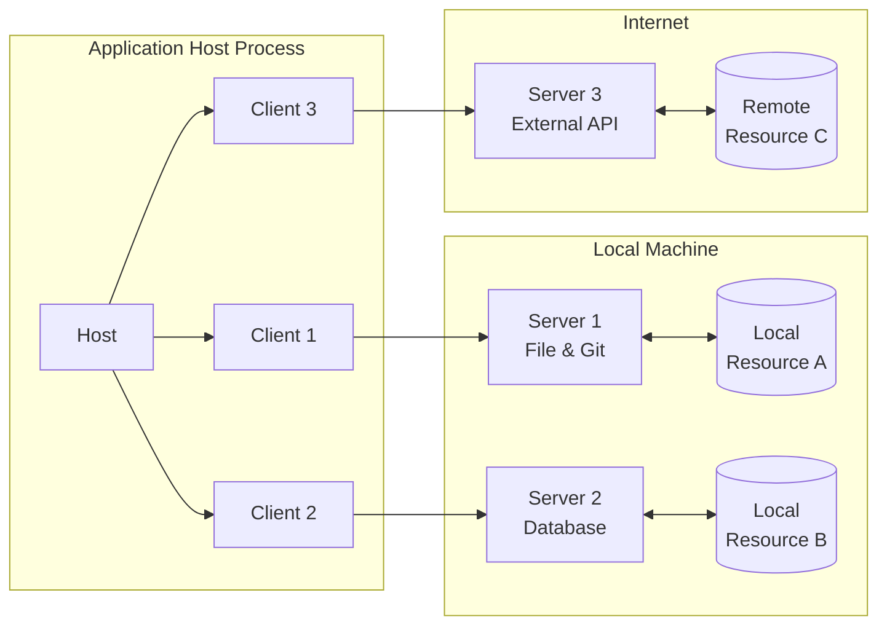

# MCP Architecture

The MCP protocol follows a client-host-server architecture where each host can run multiple client instances. This architecture enables users to integrate AI capabilities across applications while maintaining clear security boundaries and isolating issues. Built on `JSON-RPC`, MCP provides a stateful session protocol focused on context exchange and sampling coordination between clients and servers.

## MCP Protocol Architecture

MCP follows a client-server architecture. The MCP protocol architecture is shown in the diagram below:

Here, three roles are mainly involved: **Host**, **Server**, and **Client**.

- The host is an LLM application (such as Claude Desktop or IDE) that initiates the connection.
- The client maintains a 1:1 connection with the server within the host application.
- The server provides context, tools, and prompts to the client.

### Host

The host process is the central component of the MCP protocol, responsible for managing the lifecycle of client instances and coordinating communication between clients and servers. The host can run multiple client instances, each of which can connect to different servers. The host communicates with clients and servers using the JSON-RPC protocol.

- Manage the lifecycle of client instances
- Control connection permissions and execute security policies
- Coordinate AI/LLM integration
- Ensure system stability

### Server

The server is the resource storage and processing center of the MCP protocol, responsible for storing and managing local and remote resources and providing them to clients. The server can run multiple server instances, each of which can handle different types of resources. The server communicates with the host and clients using the JSON-RPC protocol.

- Expose specific resources and tools
- Independently run and manage
- Process requests through clients
- Support local and remote services

### Client

The client is used to maintain an independent connection between the host and the server, and to handle user input and output. Each client maintains a 1:1 relationship with a server, ensuring isolation and security of the connection.

- Maintain an independent connection with the server
- Establish a stateful session
- Handle protocol negotiation
- Manage message routing
