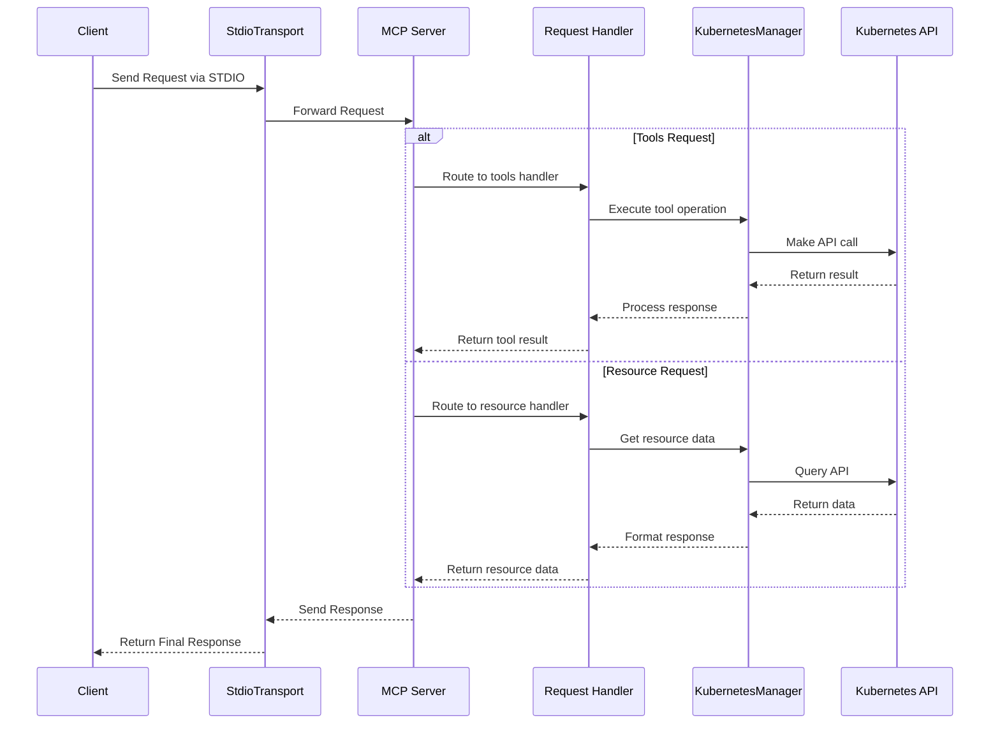

MCP Server that can connect to a Kubernetes cluster and manage it.

## Usage with Claude Desktop

```json
{
  "mcpServers": {
    "kubernetes": {
      "command": "npx",
      "args": ["mcp-server-kubernetes"]
    }
  }
}
```

The server will automatically connect to your current kubectl context. Make sure you have:

1. kubectl installed and in your PATH
2. A valid kubeconfig file with contexts configured
3. Access to a Kubernetes cluster configured for kubectl (e.g. minikube, Rancher Desktop, GKE, etc.)
4. Helm v3 installed and in your PATH (no Tiller required). Optional if you don't plan to use Helm.

You can verify your connection by asking Claude to list your pods or create a test deployment.

If you have errors open up a standard terminal and run `kubectl get pods` to see if you can connect to your cluster without credentials issues.

## Usage with mcp-chat

[mcp-chat](https://github.com/Flux159/mcp-chat) is a CLI chat client for MCP servers. You can use it to interact with the Kubernetes server.

```shell
npx mcp-chat --server "npx mcp-server-kubernetes"
```

Alternatively, pass it your existing Claude Desktop configuration file from above (Linux should pass the correct path to config):

Mac:

```shell
npx mcp-chat --config "~/Library/Application Support/Claude/claude_desktop_config.json"
```

Windows:

```shell
npx mcp-chat --config "%APPDATA%\Claude\claude_desktop_config.json"
```

## Features

- [x] Connect to a Kubernetes cluster
- [x] List all pods, services, deployments
- [x] List, Describe nodes
- [x] Create, describe, delete a pod
- [x] List all namespaces, create a namespace
- [x] Create custom pod & deployment configs, update deployment replicas
- [x] Create, describe, delete, update a service
- [x] Create, get, update, delete a ConfigMap
- [x] Get logs from a pod for debugging (supports pods, deployments, jobs, and label selectors)
- [x] Support Helm v3 for installing charts
  - Install charts with custom values
  - Uninstall releases
  - Upgrade existing releases
  - Support for namespaces
  - Support for version specification
  - Support for custom repositories
- [x] kubectl explain and kubectl api-resources support
- [x] Get Kubernetes events from the cluster
- [x] Port forward to a pod or service
- [x] Create, list, and decribe cronjobs
- [x] Non-destructive mode for read and create/update-only access to clusters

## Local Development

Make sure that you have [bun installed](https://bun.sh/docs/installation). Clone the repo & install dependencies:

```bash
git clone https://github.com/Flux159/mcp-server-kubernetes.git
cd mcp-server-kubernetes
bun install
```

### Development Workflow

1. Start the server in development mode (watches for file changes):

```bash
bun run dev
```

2. Run unit tests:

```bash
bun run test
```

3. Build the project:

```bash
bun run build
```

4. Local Testing with [Inspector](https://github.com/modelcontextprotocol/inspector)

```bash
npx @modelcontextprotocol/inspector node dist/index.js
# Follow further instructions on terminal for Inspector link
```

5. Local testing with Claude Desktop

```json
{
  "mcpServers": {
    "mcp-server-kubernetes": {
      "command": "node",
      "args": ["/path/to/your/mcp-server-kubernetes/dist/index.js"]
    }
  }
}
```

6. Local testing with [mcp-chat](https://github.com/Flux159/mcp-chat)

```bash
bun run chat
```

## Advanced

### Additional Advanced Features

For more advanced information like using SSE transport, Non-destructive mode with `ALLOW_ONLY_NON_DESTRUCTIVE_TOOLS`, see the [ADVANCED_README.md](https://github.com/Flux159/mcp-server-kubernetes/blob/main/ADVANCED_README.md).

## Architecture

This section describes the high-level architecture of the MCP Kubernetes server.

### Request Flow

The sequence diagram below illustrates how requests flow through the system:



## Publishing new release

Go to the [releases page](https://github.com/Flux159/mcp-server-kubernetes/releases), click on "Draft New Release", click "Choose a tag" and create a new tag by typing out a new version number using "v{major}.{minor}.{patch}" semver format. Then, write a release title "Release v{major}.{minor}.{patch}" and description / changelog if necessary and click "Publish Release".

This will create a new tag which will trigger a new release build via the cd.yml workflow. Once successful, the new release will be published to [npm](https://www.npmjs.com/package/mcp-server-kubernetes). Note that there is no need to update the package.json version manually, as the workflow will automatically update the version number in the package.json file & push a commit to main.
