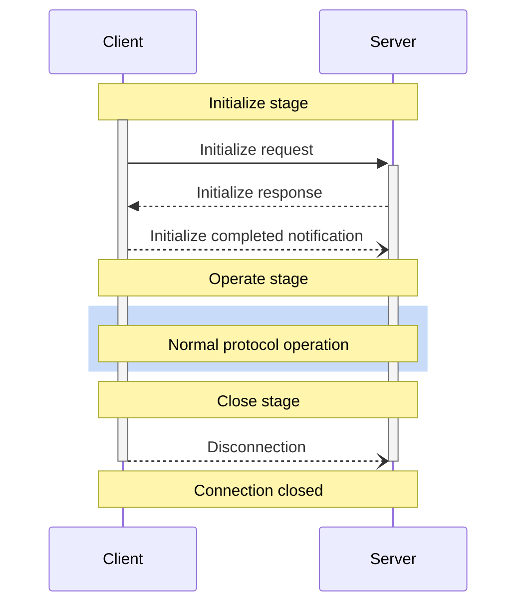
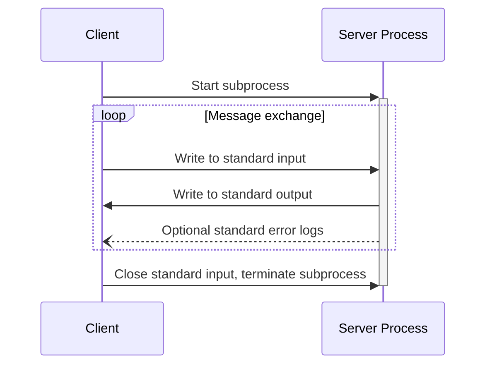
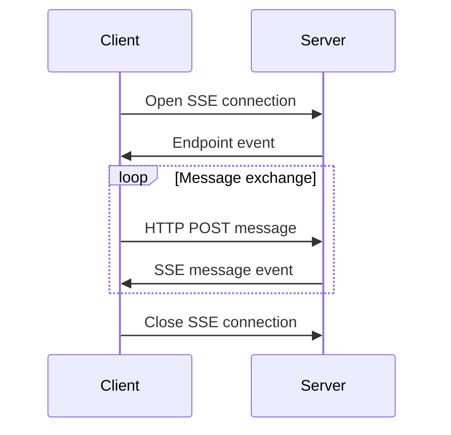

# MCP Protocol

MCP follows a client-host-server architecture. The MCP protocol is essentially a communication protocol between components, and all messages in MCP must follow the `JSON-RPC 2.0` specification.

## Message Types

MCP defines three types of messages:

- `request`：Request message, used to send requests from clients to servers, or vice versa.
- `response`：Response message, used to respond to requests.
- `notification`：Notification message, used to send notifications from servers to clients.

### Request Messages

Bidirectional messages, can be sent from clients to servers, or vice versa. Here is an example of a request message:

```json
{
  "jsonrpc": "2.0",
  "id": "string | number",
  "method": "string",
  "param?": {
    "key": "value"
  }
}
```

In a request message, there are some points to note:

- Must contain an ID of type string or number
- ID cannot be null
- In the same session, the requester cannot reuse the same ID
- Can contain an optional parameter object

### Response Messages

Response messages are replies to requests. The structure of a response message is as follows:

```json
{
  "jsonrpc": "2.0",
  "id": "string | number",
  "result?": {
    "[key: string]": "unknown"
  },
  "error?": {
    "code": "number",
    "message": "string",
    "data?": "unknown"
  }
}
```

Similarly, in a response message, there are some points to note:

- Must contain the same ID as the corresponding request
- Must set either `result` or `error`, but not both
- Error code must be an integer
- Can contain optional result data

### Notification Messages

Notification messages are one-way messages that do not require a response:

```json
{
  "jsonrpc": "2.0",
  "method": "string",
  "params?": {
    "[key: string]": "unknown"
  }
}
```

In a notification message, there are some points to note:

- Must not contain an ID field
- Used for status updates and event notifications
- Can contain optional parameter objects
- Reduce communication overhead and support asynchronous operations

## Life Cycle

MCP defines a strict life cycle for client-server connections to ensure reliability and stability. It mainly consists of three stages:

- Initialize: Ability negotiation and protocol version agreement
- Operate: Normal protocol communication
- Close: Graceful termination of the connection

As shown below:



### Initialize Stage

Initialize stage must be the first interaction between the client and the server. In this stage, both parties:

- Establish protocol version compatibility
- Exchange and negotiate capabilities
- Share implementation details

Initialize request example:

```json
{
  "jsonrpc": "2.0",
  "id": 1,
  "method": "initialize",
  "params": {
    "protocolVersion": "2024-11-05",
    "capabilities": {
      "roots": {
        "listChanged": true
      },
      "sampling": {}
    },
    "clientInfo": {
      "name": "ExampleClient",
      "version": "1.0.0"
    }
  }
}
```

In the initialize request, the client must send the protocol version it supports, as specified by the `params.protocolVersion` field in the above JSON.

- Client should send the latest version it supports
- Server must respond to the same version or another version it supports
- If the client does not support the server's version, it should disconnect

The `params.capabilities` field is used for capability negotiation. The client and server capabilities determine the optional protocol features available during the session. In the request, we specify the client's capabilities, and in the response, the server specifies its capabilities. The client can specify the following capabilities:

- `roots`：Provide file system root directory capabilities
- `sampling`：Support LLM sampling requests
- `experimental`：Describe support for non-standard experimental features

Initialize response example:

```json
{
  "jsonrpc": "2.0",
  "id": 1,
  "result": {
    "protocolVersion": "2024-11-05",
    "capabilities": {
      "logging": {},
      "prompts": {
        "listChanged": true
      },
      "resources": {
        "subscribe": true,
        "listChanged": true
      },
      "tools": {
        "listChanged": true
      }
    },
    "serverInfo": {
      "name": "ExampleServer",
      "version": "1.0.0"
    }
  }
}
```

In the initialize response, the server must respond to the same version or another version it supports. In addition, the server responds to its capabilities, as follows:

- `logging`：Provide logging capabilities
- `prompts`：Provide prompt template capabilities
- `resources`：Provide resource management capabilities
- `tools`：Provide tool calling capabilities
- `experimental`：Describe support for non-standard experimental features

After initialization, the server will send an initialization completion notification, as follows:

```json
{
  "jsonrpc": "2.0",
  "method": "initialized"
}
```

### Operate Stage

After initialization, the client and server can conduct normal protocol communication, that is, the operate stage, where the client and server exchange messages based on the negotiated capabilities.

- Adhere to the negotiated protocol version
- Only use the capabilities successfully negotiated

### Close Stage

When the client or server decides to close the connection, it will send a disconnection notification. In the close stage, the connection is gracefully terminated.

- Client sends a disconnection notification
- Server closes the connection
- Clean up related resources

Thus, the entire life cycle of MCP is complete.

## Transport Mechanism

Above we introduced the message types and life cycle of the MCP protocol, but how are these messages transmitted between the client and the server? The MCP protocol defines two standard client-server communication transmission mechanisms:

- `stdio`
- HTTP based on `SSE`（Server-Sent Events）

Note that the client should support `stdio` as much as possible, and the client and server can also implement custom transport mechanisms in a pluggable manner.

### stdio

In the stdio transport mechanism:

- Client starts the MCP server as a subprocess
- Server receives `JSON-RPC` messages through standard input (`stdin`) and writes responses through standard output (`stdout`)
- Messages are separated by newline characters, and **must not** contain embedded newline characters
- Server **can** write UTF-8 strings to standard error (`stderr`) for logging. Clients **can** capture, forward, or ignore these logs
- Server **must not** write any invalid `MCP` message content to standard output (`stdout`)
- Client **must not** write any invalid `MCP` message content to the server's standard input (`stdin`)

The following diagram shows the interaction process of the stdio transport mechanism:



### HTTP based on SSE

`SSE` stands for `Server-Sent Events`, which is an HTTP server push technology that allows servers to send real-time updates to clients. In the SSE transport mechanism of MCP, the server runs as an independent process and can handle multiple client connections.

First, the server **must** provide two endpoints:

- SSE endpoint - used to establish a connection and receive messages from the server
- HTTP POST endpoint - used to send messages from the client to the server

When the client connects, the server **must** send an endpoint event containing the URI used by the client to send messages. All subsequent client messages must be sent as HTTP POST requests to this endpoint. Server messages are sent as SSE message events, with message content encoded in JSON format in the event data.

The following diagram shows the interaction process of the HTTP transport mechanism based on SSE:



### Custom Transport Mechanism

Clients and servers **can** implement custom transport mechanisms in a pluggable manner. The protocol is independent of the transport, and can be implemented on any communication channel that supports bidirectional message exchange.

Implementers who choose to support custom transports **must** ensure that they retain the `JSON-RPC` message format and lifecycle requirements defined in MCP. Custom transports **should** record their specific connection establishment and message exchange patterns to help interoperability.
