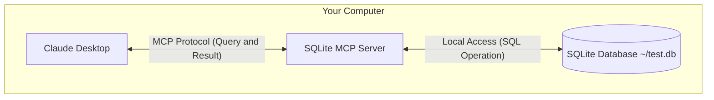

# Quick Start

After understanding some basic knowledge of MCP, we will demonstrate how to use the MCP protocol through a simple example. Here we will use the [MCP example](https://modelcontextprotocol.io/quickstart) provided by the official.

Here we will connect Claude Desktop to a local SQLite database using the MCP protocol, perform queries, and perform secure analysis, as shown in the following diagram:



The communication between the SQLite MCP server and the local SQLite database is completely on your computer — your SQLite database will not be exposed on the internet. The MCP protocol ensures that Claude Desktop can only perform approved database operations through explicitly defined interfaces. This provides you with a secure way for Claude to analyze your local data and interact with it, while maintaining full control over what it can access.

> The MCP support for Claude Desktop is currently in developer preview, only supports connecting to local MCP servers running on your machine. Remote MCP connections are not supported yet. This integration is only available in the Claude Desktop app, not in the Claude Web interface (Claude.ai).

## Preparations

Before starting, please ensure that your system has the following prerequisites installed:

- macOS or Windows operating system
- The latest version of Claude Desktop
- uv 0.4.18 or higher (check using `uv --version`)
- Git (`git --version` check)
- SQLite (`sqlite3 --version` check)

For macOS users, you can use [Homebrew](https://brew.sh/) to install these components:

```bash
# Using Homebrew
brew install uv git sqlite3

# Or download directly:
# uv: https://docs.astral.sh/uv/
# Git: https://git-scm.com
# SQLite: https://www.sqlite.org/download.html
```

For Windows users, you can use [winget](https://docs.microsoft.com/en-us/windows/package-manager/winget/) to install these components:

```bash
# Using winget
winget install --id=astral-sh.uv -e
winget install git.git sqlite.sqlite

# Or download directly:
# uv: https://docs.astral.sh/uv/
# Git: https://git-scm.com
# SQLite: https://www.sqlite.org/download.html
```

## Installation

Next, we will use macOS as an example to explain the installation process. Windows users can refer to the macOS installation steps.

First, we will create a simple SQLite database and insert some data:

```bash
# Create a new SQLite database
sqlite3 ~/test.db <<EOF
CREATE TABLE products (
  id INTEGER PRIMARY KEY,
  name TEXT,
  price REAL
);

INSERT INTO products (name, price) VALUES
  ('Widget', 19.99),
  ('Gadget', 29.99),
  ('Gizmo', 39.99),
  ('Smart Watch', 199.99),
  ('Wireless Earbuds', 89.99),
  ('Portable Charger', 24.99),
  ('Bluetooth Speaker', 79.99),
  ('Phone Stand', 15.99),
  ('Laptop Sleeve', 34.99),
  ('Mini Drone', 299.99),
  ('LED Desk Lamp', 45.99),
  ('Keyboard', 129.99),
  ('Mouse Pad', 12.99),
  ('USB Hub', 49.99),
  ('Webcam', 69.99),
  ('Screen Protector', 9.99),
  ('Travel Adapter', 27.99),
  ('Gaming Headset', 159.99),
  ('Fitness Tracker', 119.99),
  ('Portable SSD', 179.99);
EOF
```

Then download the latest [Claude Desktop app](https://claude.ai/download), install it directly, and log in to your Claude account to use it normally.

Then use any editor to open the configuration file `~/Library/Application Support/Claude/claude_desktop_config.json` of Claude Desktop.

For example, we use VSCode to open the configuration file:

```bash
# Open the configuration file
code ~/Library/Application\ Support/Claude/claude_desktop_config.json
```

Then add the following configuration:

```json
{
  "mcpServers": {
    "sqlite": {
      "command": "uvx",
      "args": ["mcp-server-sqlite", "--db-path", "/Users/YOUR_USERNAME/test.db"]
    }
  }
}
```

You need to replace `YOUR_USERNAME` with your actual username. The above configuration file indicates that we define an MCP server named `sqlite`, and specify that the `uvx` command is used to start the server, and in the `args` parameter, we specify the MCP server and the actual database path as `/Users/YOUR_USERNAME/test.db`.

After saving the above configuration, we need to restart the Claude Desktop application, and then we can see the `sqlite` MCP server in the application.

## Testing

When Claude Desktop is restarted, we can find an icon as shown in the following figure in the input box on the homepage:


This actually indicates that Claude Desktop has successfully loaded the SQLite MCP server and can be used normally. After clicking this button, we can see the available MCP Tools tool list, as shown in the following figure:


From the above figure, we can see that we can perform many operations, such as querying data in the database, creating new data, updating data, deleting data, etc.

For example, we send the following prompt to Claude Desktop:

```
Can you connect to my SQLite database and tell me what products and their prices are?
```

Then Claude Desktop will query our SQLite database according to our prompt, and the first time will pop up an authorization dialog, as shown in the following figure:


We can see that here we will choose to use the `list-tables` MCP tool, here we need to click the `Allow for This Chat` button to authorize, and then subsequent tools may also need authorization.


After authorization, we can see the query results, as shown in the following figure:


Normally, Claude Desktop will query the database according to our prompt and return the results. If this process encounters some problems, we can check the logs of Claude Desktop to troubleshoot the issues.

```bash
tail -n 20 -f ~/Library/Logs/Claude/mcp*.log


==> /Users/cnych/Library/Logs/Claude/mcp-server-sqlite.log <==
Installed 18 packages in 19ms

==> /Users/cnych/Library/Logs/Claude/mcp.log <==
2024-12-02T08:00:38.208Z [info] Attempting to connect to MCP server sqlite...
2024-12-02T08:00:38.217Z [info] Connected to MCP server sqlite!
```

## Analysis

You may still have many questions, why can we query the data in the database just by adding an sqlite MCP server in Claude Desktop? What exactly happened behind the scenes?

The interaction process between MCP and Claude Desktop is as follows:

1. **Server Discovery**: Claude Desktop connects to the MCP server you configured when it starts

2. **Protocol Negotiation**: When you ask for data, Claude Desktop:

   1. Determine which MCP server can provide help (in this example, sqlite)
   2. Negotiate capabilities through the protocol
   3. Request data or operations from the MCP server

3. **Interaction Process**:

   ```mermaid
   sequenceDiagram
      participant C as Claude Desktop
      participant M as MCP Server
      participant D as SQLite Database

      C->>M: Initialize connection
      M-->>C: Return available functions

      C->>M: Query request
      M->>D: SQL Query
      D-->>M: Return results
      M-->>C: Format results
   ```

4. **Security**:

   - MCP servers only expose specific, controlled functions
   - MCP servers run on your local computer, and the resources they access are not exposed on the internet
   - Claude Desktop requires user confirmation for sensitive operations

Here you may still have some questions about the MCP server, we didn't write any code at all? The reason is that Claude Desktop has built-in a series of MCP servers, including a SQLite MCP server, we just need to configure the database path properly. We can view the [built-in MCP server list](https://github.com/modelcontextprotocol/servers/tree/main/src) in the official git repository.


We can see that it includes a SQLite MCP server. By providing database interaction and intelligent business capabilities through SQLite, this server supports running SQL queries, analyzing business data, etc., so we can configure and use it directly. If we have our own business needs, we can also refer to these built-in implementations to customize an MCP server.

## Accessing the File System

Similarly, we can add a file system MCP server to allow Claude Desktop to manage our local file system. We can directly use the `filesystem` MCP server.

The `filesystem` MCP server implements the Model Context Protocol (MCP) for file system operations:

- Read/write files
- Create/list/delete directories
- Move files/directories
- Search files
- Get file metadata

This server supports the following Tools:

- `read_file`:

  - Read the complete contents of a file
  - Input: `path`
  - Reads the complete file content using UTF-8 encoding

- `read_multiple_files`:

  - Read multiple files simultaneously
  - Input: `paths`
  - Reading failures won't stop the entire operation

- `write_file`:

  - Create new file or overwrite existing
  - Input:
    - `path`: file location
    - `content`: file content

- `create_directory`:

  - Create new directory or ensure it exists
  - Input: `path`
  - Creates parent directories if needed
  - Silently succeeds if directory exists

- `list_directory`:

  - List directories or files with [file] or [dir] prefix
  - Input: `path`

- `move_file`:

  - Move or rename files and directories
  - Input:
    - `source`
    - `destination`
  - Fails if destination exists

- `search_files`:

  - Recursively search for files/directories
  - Input:
    - `path`: starting directory
    - `pattern`: search pattern
  - Returns full paths of matches

- `get_file_info`:

  - Get detailed file/directory metadata
  - Input: `path`
  - Returns:
    - File size
    - Creation time
    - Modification time
    - Access time
    - Type (file/directory)
    - Permissions

- `list_allowed_directories`:

  - List all directories the server is allowed to access
  - No input required
  - Returns:
    - Directories this server can read/write

Similarly, if you want to use this MCP server in Claude Desktop, you just need to configure the file path properly. For example, let's use the desktop path here:

```bash
code ~/Library/Application\ Support/Claude/claude_desktop_config.json
```

Then add the following configuration:

```json
{
  "mcpServers": {
    "filesystem": {
      "command": "npx",
      "args": [
        "-y",
        "@modelcontextprotocol/server-filesystem",
        "/Users/username/Desktop",
        "/path/to/other/allowed/dir"
      ]
    }
  }
}
```

Replace the path parameters with your actual path, for example, the complete configuration now is:

```json
{
  "mcpServers": {
    "sqlite": {
      "command": "uvx",
      "args": ["mcp-server-sqlite", "--db-path", "/Users/cnych/test.db"]
    },
    "filesystem": {
      "command": "npx",
      "args": [
        "-y",
        "@modelcontextprotocol/server-filesystem",
        "/Users/cnych/src"
      ]
    }
  }
}
```

Here we specified the `/Users/cnych/src` directory, then save the configuration file and restart the Claude Desktop application, we can now see a `15` button in the lower right corner of the input box:


Clicking it will display the available MCP Tools list, as shown in the following figure:


We can see that we can read files, create files, list directories, move files, search files, etc.

We send the prompt `Can you list the contents of my src directory?` and Claude Desktop will list all the files and directories under the specified directory, as shown in the following figure, of course, the process also requires authorization.


Let it help us write a markdown usage guide and save it to the `markdown-usage.md` file `Write a complete guide to markdown and save it to markdown-usage.md file`.


After authorization, we can see that Claude Desktop will automatically write the file to the specified path on our local machine, as shown in the following figure:


