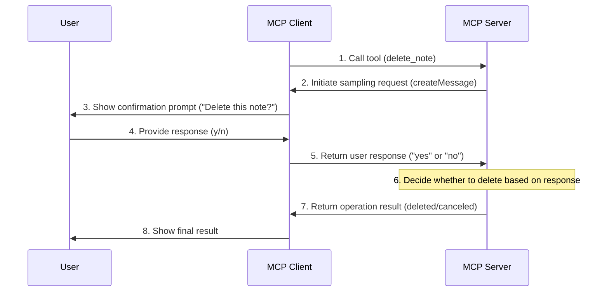

# The Sampling Feature in MCP

As previously mentioned, MCP provides not only `Resources`, `Prompts`, and `Tools` but also a `Sampling` feature. While the term might seem abstract at first glance, this functionality essentially allows servers to request user confirmation or interactive decision-making during certain operations. For example, when invoking a tool to delete local files, we would naturally want confirmation before proceeding—this is where the Sampling feature comes into play.

This represents a special capability within the MCP protocol, enabling developers to request user input before critical operations. In MCP, "Sampling" refers to servers initiating requests to clients, asking users (typically via large language models) to provide specific inputs. These inputs could be answers to questions or confirmations for actions.

This differs from traditional server-client models. In MCP, servers can actively send requests to clients, asking them to provide certain forms of "samples" or "inputs"—hence the term "Sampling."

## How It Works

The overall workflow of the `Sampling` feature is as follows:

1. The server sends a `sampling/createMessage` request to the client.
2. The client reviews the request and can modify it if needed.
3. The client performs `sampling` with the LLM.
4. The client reviews the completion results.
5. The client returns the results to the server.

This human-in-the-loop design ensures users maintain control over what the LLM sees and generates.

## Message Format

The `Sampling` feature also uses a standardized message format:

```json
{
  messages: [
    {
      role: "user" | "assistant",
      content: {
        type: "text" | "image",
        // For text:
        text?: string,
        // For images:
        data?: string,             // base64-encoded
        mimeType?: string
      }
    }
  ],
  modelPreferences?: {  // Model preferences
    hints?: [{
      name?: string                // Model name
    }],
    costPriority?: number,         // Cost priority
    speedPriority?: number,        // Speed priority
    intelligencePriority?: number  // Intelligence priority
  },
  systemPrompt?: string,          // System prompt
  includeContext?: "none" | "thisServer" | "allServers", // Context inclusion
  temperature?: number,           // Temperature
  maxTokens: number,             // Maximum tokens
  stopSequences?: string[],      // Stop sequences
  metadata?: Record<string, unknown> // Metadata
}
```

The `messages` array contains the conversation history to be sent to the LLM. Each message includes:

- `role`: Either `user` or `assistant`.
- `content`: The message content, which can be:
  - Text content with a `text` field.
  - Image content with `data (base64)` and `mimeType` fields.

Next are the model preference settings. The `modelPreferences` object allows servers to specify their model selection preferences:

- `hints`: An array of suggested model names that clients can use to select appropriate models:
  - `name`: A string that can match full or partial model names (e.g., "claude-3", "sonnet").
  - Clients may map hints to equivalent models from different providers.
  - Multiple hints are evaluated in order of priority.
- Priorities:
  - `costPriority`: The importance of minimizing costs.
  - `speedPriority`: The importance of low-latency responses.
  - `intelligencePriority`: The importance of advanced model capabilities.

Clients make the final model selection based on these preferences and their available models.

The `systemPrompt` field allows MCP servers to request specific system prompts. Clients can modify or ignore these prompts.

The `includeContext` parameter specifies which MCP context content should be included:

- `none`: No additional context is included.
- `thisServer`: Context from the requesting server is included.
- `allServers`: Context from all connected MCP servers is included.

Clients control the actual context inclusion.

Sampling parameters fine-tune LLM sampling behavior:

- `temperature`: Controls randomness (0.0 to 1.0).
- `maxTokens`: The maximum number of tokens to generate.
- `stopSequences`: An array of sequences that stop generation.
- `metadata`: Provider-specific additional parameters.

Finally, the response format includes a completion result from the client:

```json
{
  model: string, // Name of the model used
  stopReason?: "endTurn" | "stopSequence" | "maxTokens" | string,
  role: "user" | "assistant",
  content: {
    type: "text" | "image",
    text?: string,
    data?: string,
    mimeType?: string
  }
}
```

Here, `model` is the name of the model used for generating the completion, `stopReason` indicates why generation stopped, `role` specifies the role of the completion, and `content` contains the completion itself.

## Best Practices

When implementing the Sampling feature, follow these best practices:

- Always provide clear, well-structured prompts.
- Handle text and image content appropriately.
- Set reasonable token limits.
- Include relevant context via `includeContext`.
- Validate response content before use.
- Handle errors gracefully.
- Consider rate-limiting sampling requests.
- Document expected sampling behavior.
- Test with various model parameters.
- Monitor sampling costs.

## Human Oversight Controls

Sampling is designed with human supervision in mind:

**For Prompts**

- Clients should display suggested prompts to users.
- Users should be able to modify or reject prompts.
- System prompts can be filtered or modified.
- Context inclusion is controlled by the client.

**For Completions**

- Clients should display completion results to users.
- Users should be able to modify or reject completions.
- Clients can filter or modify completions.
- Users control which model is used.

**Security Considerations**

When implementing Sampling:

- Validate all message content.
- Sanitize sensitive information.
- Implement appropriate rate limits.
- Monitor sampling usage.
- Encrypt data in transit.
- Handle user data privacy.
- Audit sampling requests.
- Control cost exposure.
- Implement timeouts.
- Handle model errors gracefully.

## Common Patterns

**Agentic Autonomous Workflows**

Sampling enables agentic autonomous behaviors, such as:

- Reading and analyzing resources.
- Making context-based decisions.
- Generating structured data.
- Handling multi-step tasks.
- Providing interactive assistance.

**Context Management**

Best practices for context:

- Request the minimal necessary context.
- Structure context clearly.
- Handle context size limits.
- Update context as needed.
- Clean up outdated context.

**Error Handling**

Robust error handling should:

- Catch sampling failures.
- Handle timeout errors.
- Manage rate limits.
- Validate responses.
- Provide fallback behaviors.
- Log errors properly.

**Limitations**

Be aware of these limitations:

- Sampling depends on client capabilities.
- Users control sampling behavior.
- Context size is limited.
- Rate limits may apply.
- Costs should be considered.
- Model availability varies.
- Response times vary.
- Not all content types are supported.

## Hands-on Implementation

Now, let's implement an MCP server with file deletion functionality, using the `Sampling` feature to enable agentic autonomous behavior for file deletion.



First, initialize the MCP server:

```bash
$ npx @modelcontextprotocol/create-server mcpdemo
? What is the name of your MCP server? mcpdemo
? What is the description of your server? A Model Context Protocol server
? Would you like to install this server for Claude.app? No
✔ MCP server created successfully!

Next steps:
  cd mcpdemo
  npm install
  npm run build  # or: npm run watch
  npm link       # optional, to make available globally

$ cd mcpdemo
$ npm i

> mcpdemo@0.1.0 prepare
> npm run build


> mcpdemo@0.1.0 build
> tsc && node -e "require('fs').chmodSync('build/index.js', '755')"


added 17 packages, and audited 18 packages in 6s

1 package is looking for funding
  run `npm fund` for details

found 0 vulnerabilities
```

Next, modify the `src/index.ts` file. First, enable the `sampling` feature in the server configuration:

```ts
const server = new Server(
  {
    name: "mcpdemo",
    version: "0.1.0",
  },
  {
    capabilities: {
      resources: {},
      tools: {},
      prompts: {},
      sampling: {}, // Enable sampling
    },
  }
);
```

Then, add a tool for deleting notes:

```ts
/**
 * Handler that lists available tools.
 * Exposes tools for creating and deleting notes.
 */
server.setRequestHandler(ListToolsRequestSchema, async () => {
  return {
    tools: [
      // {  // Original create_note tool
      //   name: "create_note",
      //   // ...
      // },
      {
        name: "delete_note",
        description: "Delete an existing note with confirmation",
        inputSchema: {
          type: "object",
          properties: {
            id: {
              type: "string",
              description: "ID of the note to delete",
            },
          },
          required: ["id"],
        },
      },
    ],
  };
});
```

The key implementation is in the `delete_note` tool request handler:

```ts
/**
 * Handler for tool calls.
 * Handles both create_note and delete_note tools.
 */
server.setRequestHandler(CallToolRequestSchema, async (request) => {
  switch (request.params.name) {
    case "create_note": {
      // ...Original create_note logic
    }

    case "delete_note": {
      const id = String(request.params.arguments?.id);
      if (!id) {
        throw new Error("Note ID is required");
      }

      const note = notes[id];
      if (!note) {
        throw new Error(`Note ${id} not found`);
      }

      try {
        // Send a sampling request to the client for user confirmation
        const confirmationResponse = await server.createMessage({
          messages: [
            {
              role: "user",
              content: {
                type: "text",
                text: `Are you sure you want to delete the note "${note.title}"? Please reply "yes" or "no".`,
              },
            },
          ],
          systemPrompt:
            "You are an assistant helping users confirm file deletions. Reply only with 'yes' or 'no'.",
          maxTokens: 10,
          temperature: 0.1,
          includeContext: "none",
        });

        // Extract the user's response text
        let userResponse = "";
        if (
          confirmationResponse?.content?.type === "text" &&
          typeof confirmationResponse?.content?.text === "string"
        ) {
          userResponse = confirmationResponse.content.text.toLowerCase();
        }

        // Check if the user confirmed deletion
        if (userResponse.includes("yes")) {
          // Delete the note
          delete notes[id];
          return {
            content: [
              {
                type: "text",
                text: `Deleted note ${id}: ${note.title}`,
              },
            ],
          };
        } else {
          // User didn't confirm, cancel deletion
          return {
            content: [
              {
                type: "text",
                text: `Cancelled deletion of note ${id}: ${note.title}`,
              },
            ],
          };
        }
      } catch (error) {
        // Handle sampling or deletion errors
        const errorMessage =
          error instanceof Error ? error.message : String(error);
        return {
          content: [
            {
              type: "text",
              text: `Deletion failed: ${errorMessage}`,
            },
          ],
        };
      }
    }

    default:
      throw new Error("Unknown tool");
  }
});
```

When handling note deletion, we send a sampling request to the client asking for user confirmation. We use the `server.createMessage` method to send the sampling request, with parameters matching the `Sampling` feature message format described earlier:

```ts
const confirmationResponse = await server.createMessage({
  messages: [
    {
      role: "user",
      content: {
        type: "text",
        text: `Are you sure you want to delete the note "${note.title}"? Please reply "yes" or "no".`,
      },
    },
  ],
  systemPrompt: "You are an assistant helping users confirm file deletions. Reply only with 'yes' or 'no'.",
  maxTokens: 10,
  temperature: 0.1,
  includeContext: "none",
});
```

The MCP client needs to handle this sampling request and provide a response. The server then decides whether to delete the note based on the user's response. Our logic here is simple: if the response contains "yes", we delete the note; otherwise, we don't.

Thus, the client must support sampling requests and provide responses. Here's how we can implement client-side sampling handling:

```ts
// Initialize the client with sampling enabled
const client = new Client(
  { name: "mcpdemo-client", version: "0.1.0" },
  {
    capabilities: {
      sampling: {}, // Enable sampling
    },
  }
);

// Handle sampling requests
function setupSampling(client: Client) {
  const confirmHandler = new SamplingConfirmHandler();

  client.setRequestHandler(CreateMessageRequestSchema, async (request) => {
    // Extract user messages
    const userMessages = request.params.messages.filter(
      (m) => m.role === "user"
    );
    const lastUserMessage = userMessages[userMessages.length - 1];

    // Get text content
    let userRequest = "No clear operation specified";
    if (lastUserMessage?.content.type === "text") {
      userRequest = lastUserMessage.content.text;
    }

    // Analyze the request
    const analysis = await confirmHandler.analyzeRequest({
      model: "model",
      role: "assistant",
      content: {
        type: "text",
        text: userRequest,
      },
      systemPrompt: request.params.systemPrompt,
    });

    // Get user confirmation
    const isConfirmed = await confirmHandler.getConfirmation(
      `Do you want to proceed with this operation? (y/n): `,
      20000
    );

    // Return response
    const response = isConfirmed ? "yes" : "no";

    return {
      model: "stub-model",
      stopReason: "endTurn",
      role: "assistant",
      content: {
        type: "text",
        text: response,
      },
    };
  });
}
```

In the client code above, we use `client.setRequestHandler(CreateMessageRequestSchema, async (request) => {}` to handle sampling requests. We can assemble the parameters sent by the server into an LLM request. Since the server passes parameters like `systemPrompt`, `maxTokens`, `temperature`, and `messages`, the client's handling logic depends on the specific scenario. For example, we might skip LLM analysis entirely and simply prompt the user for confirmation.

Here's our testing process:

```bash
npm run client

> mcpdemo@0.1.0 client
> node dist/client.js


[Success] Connected to server
[Info] Enter a command or 'exit' to quit:

> List all note resources
✓ Analysis complete (time: 6.03s)
[AI] Decision: I will list all available resources

--- Listing all resources ---
[Info] Found 2 resources
[Info] Available resources:
1. First Note (note:///1)
   A text note: First Note
2. Second Note (note:///2)
   A text note: Second Note


> Delete note 1
✓ Analysis complete (time: 8.23s)
[AI] Decision: I will call a tool to delete the specified note
[AI] I will call the "delete_note" tool to fulfill your request

--- Calling tool: delete_note ---
[Info] Tool description: Delete an existing note with confirmation
[Info] Input parameters:
[Info]   id: "1"

--- Received server sampling request ---
✓ Analysis result: no (time: 4.29s)
[Info] Please respond within 20 seconds; default is "no"
Do you want to proceed with this operation? (y/n):
[Analysis result: no]y
[Info] User decision: yes
[Info] Tool return content:
[Info] Deleted note 1: First Note

>
```

From the test above, we can see that when entering `Delete note 1`, after LLM analysis, the system determines it needs to call the `delete_note` tool. The MCP server then sends a sampling request to the client asking for user confirmation before deletion. If the user confirms, the note is deleted; otherwise, the operation is canceled.

## Summary

Through this hands-on implementation, we've seen how the `Sampling` feature is a crucial capability in MCP. It enables servers to request LLM completions through clients, facilitating complex agentic behaviors while maintaining security and privacy.