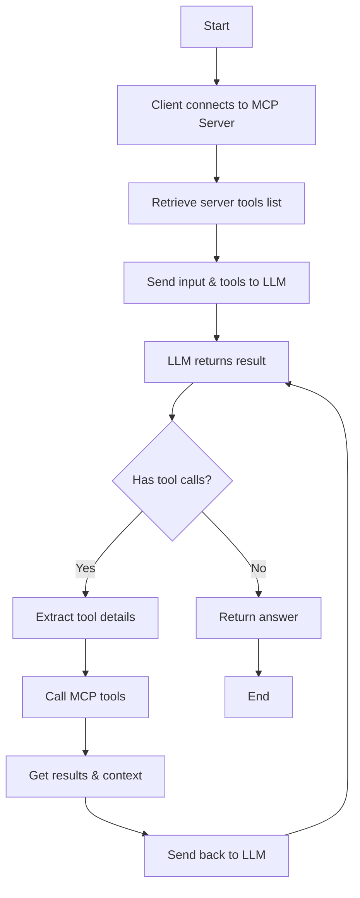

# Writing a TypeScript MCP Client

In the [previous section](/docs/write-ts-server), we successfully developed a weather MCP Server, which can now be used in any client that supports the MCP protocol, such as Claude Desktop, Cursor, etc.


But what if we want to develop our own client? Let's explore how to create an MCP client.

## Workflow

Developing an MCP client is straightforward:

1. First, connect the client to the MCP Server
2. After connection, retrieve the list of tools provided by the server (including resources and prompts)
3. Send the client's input and tool list to a tool-enabled LLM (OpenAI, Anthropic, etc.)
4. Extract tool names and parameters from the LLM's response
5. Use the extracted tool names and parameters to call the MCP server tools
6. After tool execution, send the results and new context (including prompts and resources) back to the LLM
7. Repeat these steps until the LLM returns a completion

You can refer to the following workflow:



## Preparation

Next, we will use TypeScript to develop an MCP client that can call the weather forecast service we developed earlier. The following environment is required:

- Node.js 16 or later
- npm latest version
- Anthropic API key (Claude)

Then, we create a project directory and initialize the npm project:

```bash
mkdir mcpclient-demo
cd mcpclient-demo
npm init -y
```

Install dependencies:

```bash
npm install @anthropic-ai/sdk @modelcontextprotocol/sdk dotenv
npm install -D @types/node typescript
```

Create the source file:

```bash
touch index.ts
```

Update the `package.json` file content, add the `build` script and set the type to `module`:

```json
{
  "name": "mcpclient-demo",
  "version": "1.0.0",
  "main": "index.js",
  "type": "module",
  "scripts": {
    "build": "tsc && chmod 755 build/index.js"
  },
  "keywords": [],
  "author": "",
  "license": "ISC",
  "description": "",
  "dependencies": {
    "@anthropic-ai/sdk": "^0.39.0",
    "@modelcontextprotocol/sdk": "^1.7.0",
    "dotenv": "^16.4.7"
  },
  "devDependencies": {
    "@types/node": "^22.13.12",
    "typescript": "^5.8.2"
  }
}
```

Since we are using TypeScript, we also need to create a `tsconfig.json` file in the root directory, which is the configuration file for TypeScript, the content is as follows:

```json
{
  "compilerOptions": {
    "target": "ES2022",
    "module": "Node16",
    "moduleResolution": "Node16",
    "outDir": "./build",
    "rootDir": "./",
    "strict": true,
    "esModuleInterop": true,
    "skipLibCheck": true,
    "forceConsistentCasingInFileNames": true
  },
  "include": ["index.ts"],
  "exclude": ["node_modules"]
}
```

Then, write the prepared `ANTHROPIC_API_KEY` and other environment variables into the `.env` file:

```text
ANTHROPIC_API_KEY=sk-xxxx
ANTHROPIC_BASE_URL=https://api.anthropic.com
ANTHROPIC_MODEL=claude-3-7-sonnet-20250219
```

## Create the client

Next, we can start creating the client.

> All operations are performed in the `index.ts` file.

First, we need to read the API Key and other configuration from the environment variables:

```typescript
import dotenv from "dotenv";

dotenv.config();

const ANTHROPIC_API_KEY = process.env.ANTHROPIC_API_KEY;
const ANTHROPIC_BASE_URL =
  process.env.ANTHROPIC_BASE_URL || "https://api.anthropic.com";
const ANTHROPIC_MODEL =
  process.env.ANTHROPIC_MODEL || "claude-3-7-sonnet-20250219";

if (!ANTHROPIC_API_KEY) {
  throw new Error("ANTHROPIC_API_KEY is not set");
}

if (!ANTHROPIC_BASE_URL) {
  throw new Error("ANTHROPIC_BASE_URL is not set");
}
```

Then, create a `MCPClient` class and initialize the MCP client and Anthropic client:

```typescript
import { Client } from "@modelcontextprotocol/sdk/client/index.js";
import { Tool } from "@anthropic-ai/sdk/resources/messages/messages.mjs";
import { StdioClientTransport } from "@modelcontextprotocol/sdk/client/stdio.js";
import { Anthropic } from "@anthropic-ai/sdk";

class MCPClient {
  private mcp: Client;
  private anthropic: Anthropic;
  private transport: StdioClientTransport | null = null;
  private tools: Tool[] = [];

  constructor() {
    this.anthropic = new Anthropic({
      apiKey: ANTHROPIC_API_KEY,
      baseURL: ANTHROPIC_BASE_URL,
    });
    this.mcp = new Client({ name: "mcpclient-demo", version: "1.0.0" });
  }
}
```

Here, we use Claude's API as the implementation of LLM, where the `mcp` property is an MCP client, which can be directly created by `new Client`, thus we have all the capabilities of the MCP client.

Next, we need to connect our MCP client to the MCP server we developed earlier. Since our MCP server is a Node.js script, we only need to provide the script path, and then connect through `StdioClientTransport`. After successful connection, we can use the `listTools` method to get the tool list provided by the server.

```typescript
async connectToServer(serverScriptPath: string) {
    try {
      const isJs = serverScriptPath.endsWith(".js");
      if (!isJs) {
        throw new Error("Server script must be a .js file");
      }
      const command = process.execPath;

      // Initialize transport
      this.transport = new StdioClientTransport({
        command,
        args: [serverScriptPath],
      });
      // Connect to server
      this.mcp.connect(this.transport);
      // Get tools list
      const toolsResult = await this.mcp.listTools();
      this.tools = toolsResult.tools.map((tool) => {
        return {
          name: tool.name,
          description: tool.description,
          input_schema: tool.inputSchema,
        };
      });
      console.log(
        "Connected to server with tools:",
        this.tools.map(({ name }) => name)
      );
    } catch (e) {
      console.log("Failed to connect to MCP server: ", e);
      throw e;
    }
  }
```

The tool list has been obtained, so now we need to know how to use these tools.

For example, if we are a chat application, the normal process is to send our request to the LLM, and then the LLM returns the result. Now, we want to call the tools provided by our server at the appropriate time, so what should we do?

It's also simple, we just need to send our request and tools to the LLM (here we use Anthropic), and then the LLM returns the result. If the result needs to call a tool, we can call the tool through the `callTool` method of the MCP client, and then send the tool execution result back to the LLM for processing once. Finally, we can get the final result.

Now, let's see the specific implementation:

```typescript
  async processQuery(query: string) {
    // Initialize messages
    const messages: MessageParam[] = [
      {
        role: "user",
        content: query,
      },
    ];

    // Call anthropic
    const response = await this.anthropic.messages.create({
      model: ANTHROPIC_MODEL,
      max_tokens: 1000,
      messages,
      tools: this.tools,
    });

    // Initialize finalText and toolResults
    const finalText = [];
    const toolResults = [];

    // Iterate through response.content
    for (const content of response.content) {
      if (content.type === "text") {  // If content is text, it means it's a text
        finalText.push(content.text);
      } else if (content.type === "tool_use") {  // If content is tool_use, it means it needs to call a tool
        // Get toolName and toolArgs
        const toolName = content.name;
        const toolArgs = content.input as { [x: string]: unknown } | undefined;

        // Call tool
        const result = await this.mcp.callTool({
          name: toolName,
          arguments: toolArgs,
        });

        // Add tool call information to finalText
        finalText.push(
          `[Calling tool ${toolName} with args ${JSON.stringify(toolArgs)}]`
        );

        // Add tool call result to messages
        messages.push({
          role: "user",
          content: result.content as string,
        });

        // Call anthropic
        const response = await this.anthropic.messages.create({
          model: ANTHROPIC_MODEL,
          max_tokens: 1000,
          messages,
        });

        // Merge tool call result to finalText
        finalText.push(
          response.content[0].type === "text" ? response.content[0].text : ""
        );
      }
    }

    return finalText.join("\n");
  }

  async chatLoop() {
    const rl = readline.createInterface({
      input: process.stdin,
      output: process.stdout,
    });

    try {
      console.log("\nMCP Client Started!");
      console.log("Type your queries or 'exit' to exit.");

      while (true) {
        // Read user input
        const message = await rl.question("\nQuery: ");
        // If user input exit, exit
        if (message.toLowerCase() === "exit") {
          break;
        }

        try {
          // Process user input
          const response = await this.processQuery(message);
          // Output result
          console.log("\n" + response);
        } catch (e) {
          console.log("Error: ", e);
        }
      }
    } finally {
      rl.close();
    }
  }

  async cleanup() {
    await this.mcp.close();
  }
```

Here, we have completed the core functionality of an MCP client - calling the tools provided by the server. Finally, we only need to perform some initialization operations in the `main` function to start our chat.

```typescript
async function main() {
  if (process.argv.length < 3) {
    console.log("Usage: node index.ts <path_to_server_script>");
    return;
  }
  const mcpClient = new MCPClient();
  try {
    await mcpClient.connectToServer(process.argv[2]);
    await mcpClient.chatLoop();
  } finally {
    await mcpClient.cleanup();
    process.exit(0);
  }
}

main();
```

## Test

Next, execute the following command to build the client:

```bash
npm run build
```

The above command will generate a `build/index.js` file, and then we can start testing.

```bash
node build/index.js
Usage: node index.ts <path_to_server_script>
```

We can see that we only need to pass in a MCP server script path here, and then we can start testing.

```bash
node build/index.js /Users/cnych/src/weather-server/build/index.js
# output
Weather MCP server running on stdio
Connected to server with tools: [ 'get_forecast' ]

MCP Client Started!
Type your queries or 'exit' to exit.

Query: Beijing weather for the next 3 days

I can get the weather forecast for Beijing for the next 3 days. Let me do that for you now.
[Calling tool get_forecast with args {"city":"Beijing","days":3}]
# Beijing Weather Forecast

## Next 3 Days:
- **March 24, 2025**: 21°C with overcast clouds
- **March 25, 2025**: 21°C with scattered clouds
- **March 26, 2025**: 20°C with overcast clouds

The temperature will remain relatively stable around 20-21°C over the next three days, with cloudy conditions throughout. March 25th will have partially clear skies with scattered clouds, while the other days will be predominantly overcast.

Query:
```

The MCP server script we provided is the weather forecast service we developed earlier, here we require the weather forecast for Beijing for the next 3 days, and we can see that we have called the `get_forecast` tool provided by the server, and passed in the `city` and `days` parameters, and then we can get the final result.


Here, we have completed the development of a very simple MCP client, and through this client we can call the tools provided by the server and get the final result.

Of course, this client is very simple, it is only a Stdio protocol, if you want to link an SSE protocol MCP server, then we need to add an SSE protocol client, we will introduce it in the subsequent chapters.
