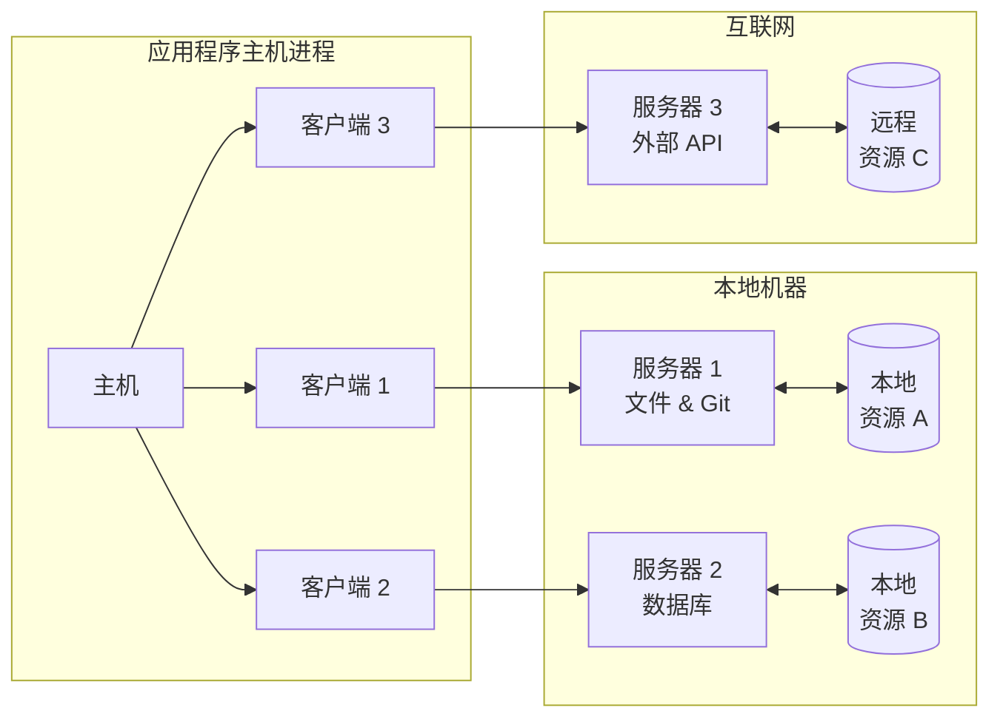

# MCP 架构

MCP 协议遵循客户端-主机-服务器架构，其中每个主机可以运行多个客户端实例。该架构使用户能够跨应用程序集成 AI 能力，同时保持清晰的安全边界并隔离问题。MCP 基于 `JSON-RPC` 构建，提供了一个有状态会话协议，专注于客户端和服务器之间的上下文交换和采样协调。

## MCP 协议架构

MCP 遵循客户端-服务器架构，MCP 协议架构如下图所示：

这里主要涉及到三个角色：**主机**、**服务器**和**客户端**。

- 主机是发起连接的 LLM 应用程序（如 Claude Desktop 或 IDE）
- 客户端在主机应用程序内部与服务器保持 1:1 连接
- 服务器向客户端提供上下文、工具和提示

### 主机

主机进程是 MCP 协议的中心组件，负责管理客户端实例的生命周期，并协调客户端与服务器之间的通信。主机可以运行多个客户端实例，每个客户端实例可以连接到不同的服务器。主机通过 JSON-RPC 协议与客户端和服务器进行通信。

- 管理客户端实例的生命周期
- 控制连接权限和执行安全策略
- 协调 AI/LLM 集成
- 确保系统稳定运行

### 服务器

服务器是 MCP 协议的资源存储和处理中心，负责存储和管理本地和远程资源，并提供给客户端使用。服务器可以运行多个服务器实例，每个服务器实例可以处理不同的资源类型。服务器通过 JSON-RPC 协议与主机和客户端进行通信。

- 公开特定的资源和工具
- 独立运行和管理
- 通过客户端处理请求
- 支持本地和远程服务

### 客户端

客户端用于维护主机与服务器的独立连接，并处理用户的输入和输出。每个客户端都与一个服务器保持 1:1 的关系，确保连接的隔离性和安全性。

- 维护与服务器的独立连接
- 建立有状态会话
- 处理协议协商
- 管理消息路由
