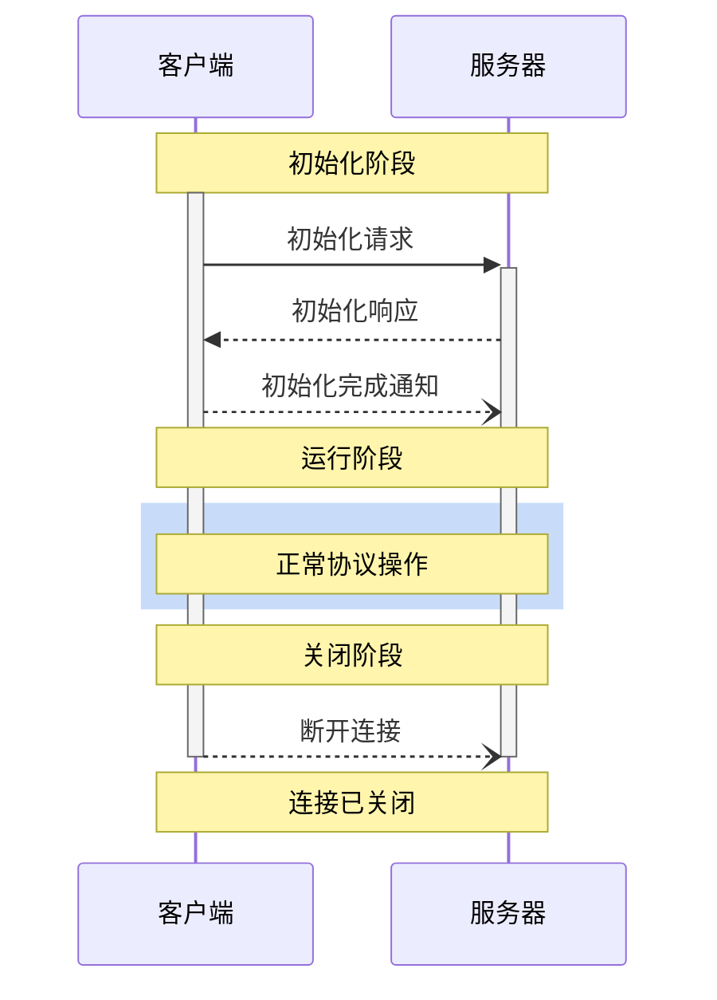
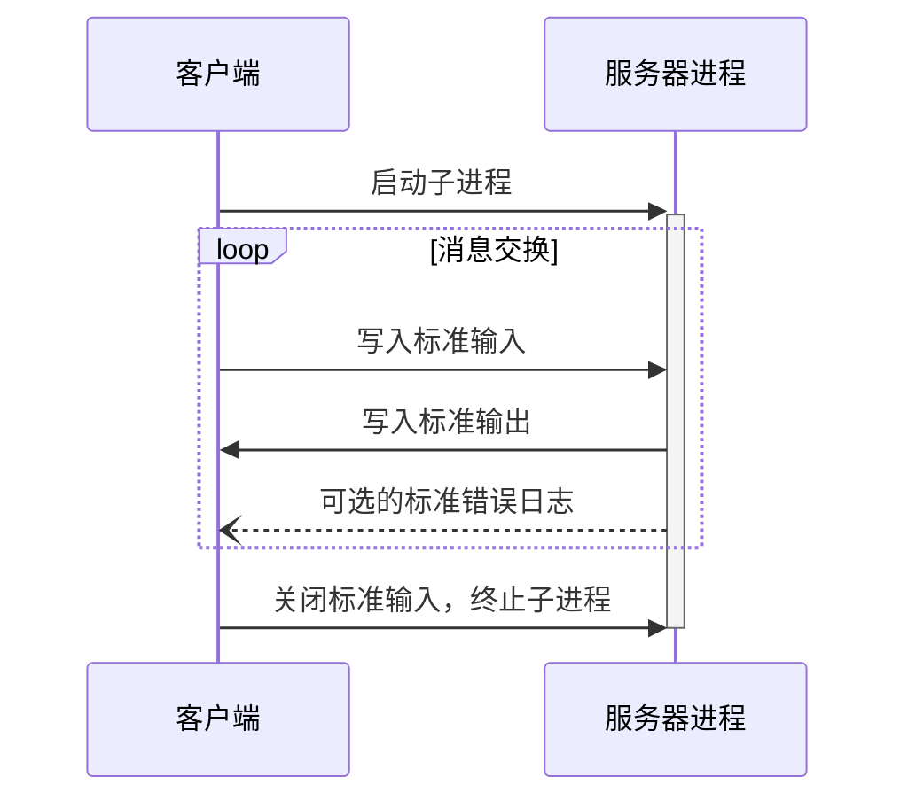
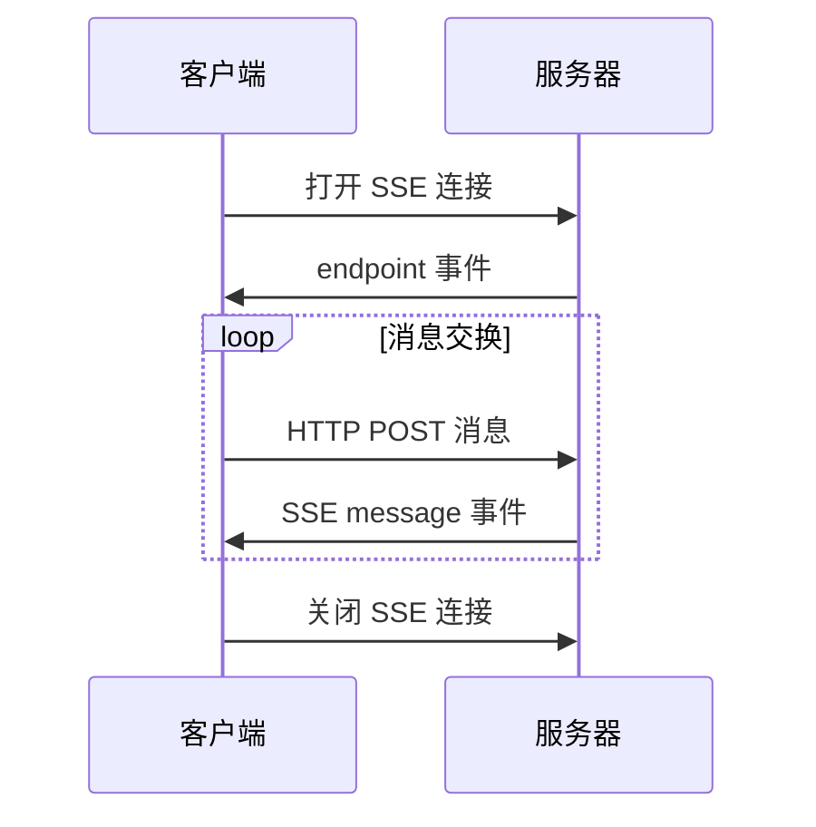

# MCP 基础协议

MCP 协议遵循客户端-主机-服务器架构，MCP 协议其实就是规定的组件之间的通信协议，而 MCP 中的所有消息必须遵循 `JSON-RPC 2.0` 规范。

## 消息类型

MCP 协议定义了三种类型的消息：

- `request`：请求消息，用于客户端向服务器发送请求，也可以从服务器发送到客户端。
- `response`：响应消息，用于对请求的响应。
- `notification`：通知消息，用于服务器向客户端发送通知。

### 请求消息

双向消息，可以从客户端发送到服务器，也可以反向发送。如下所示就是一个请求消息的示例：

```json
{
  "jsonrpc": "2.0",
  "id": "string | number",
  "method": "string",
  "param?": {
    "key": "value"
  }
}
```

在请求消息中，有一些需要注意的点：

- 必须包含字符串或整数类型的 ID
- ID 不能为 null
- 在同一会话中，请求方不能重复使用相同的 ID
- 可以包含可选的参数对象

### 响应消息

响应消息是对请求的回复，响应消息的结构如下所示：

```json
{
  "jsonrpc": "2.0",
  "id": "string | number",
  "result?": {
    "[key: string]": "unknown"
  },
  "error?": {
    "code": "number",
    "message": "string",
    "data?": "unknown"
  }
}
```

同样，在响应消息中，也有一些需要注意的点：

- 必须包含与对应请求相同的 ID
- 必须设置 `result` 或 `error` 其中之一，不能同时设置
- 错误码必须是整数
- 可以包含可选的结果数据

### 通知消息

通知是一种单向消息，不需要响应：

```json
{
  "jsonrpc": "2.0",
  "method": "string",
  "params?": {
    "[key: string]": "unknown"
  }
}
```

在通知消息中，有一些需要注意的点：

- 不能包含 ID 字段
- 用于状态更新和事件通知
- 可以包含可选的参数对象
- 减少通信开销，支持异步操作

## 生命周期

MCP 为客户端-服务器连接定义了严格的生命周期，确保连接的可靠性和稳定性。主要分为三个阶段：

- 初始化：能力协商和协议版本约定
- 操作：正常协议通信
- 关闭：正常终止连接

如下图所示：



### 初始化阶段

初始化阶段必须是客户端和服务器之间的第一次交互。在此阶段，双方：

- 建立协议版本兼容性
- 交换和协商能力
- 共享实现细节

初始化请求示例：

```json
{
  "jsonrpc": "2.0",
  "id": 1,
  "method": "initialize",
  "params": {
    "protocolVersion": "2024-11-05",
    "capabilities": {
      "roots": {
        "listChanged": true
      },
      "sampling": {}
    },
    "clientInfo": {
      "name": "ExampleClient",
      "version": "1.0.0"
    }
  }
}
```

要注意 ⚠️ 在初始化请求中，客户端必须发送其支持的协议版本，上面 json 中的 `params.protocolVersion` 字段就是来指定协议版本的。

- 客户端应发送其支持的最新版本
- 服务器必须响应相同版本或其支持的其他版本
- 如果客户端不支持服务器的版本，应断开连接

而 `params.capabilities` 字段用于能力协商，客户端和服务器能力确定会话期间可用的可选协议功能。在请求中我们指定客户端的能力，在响应中服务器会指定其能力，客户端可以指定如下能力：

- `roots`：提供文件系统根目录的能力
- `sampling`：支持 LLM 采样请求
- `experimental`：描述对非标准实验性功能的支持

初始化响应示例：

```json
{
  "jsonrpc": "2.0",
  "id": 1,
  "result": {
    "protocolVersion": "2024-11-05",
    "capabilities": {
      "logging": {},
      "prompts": {
        "listChanged": true
      },
      "resources": {
        "subscribe": true,
        "listChanged": true
      },
      "tools": {
        "listChanged": true
      }
    },
    "serverInfo": {
      "name": "ExampleServer",
      "version": "1.0.0"
    }
  }
}
```

在初始化响应中，服务器必须响应相同版本或其支持的其他版本。此外服务器会响应其能力，如下：

- `logging`：提供日志记录的能力
- `prompts`：提供提示词的模板能力
- `resources`：提供资源管理的能力
- `tools`：提供工具调用的能力
- `experimental`：描述对非标准实验性功能的支持

初始化完成后，服务器会发送初始化完成通知，如下所示：

```json
{
  "jsonrpc": "2.0",
  "method": "initialized"
}
```

### 操作阶段

初始化完成后，客户端和服务器就可以进行正常的协议通信了，也就是上面的操作阶段，客户端和服务器根据协商的能力交换消息。

- 遵守协商的协议版本
- 仅使用成功协商的能力

### 关闭阶段

当客户端或服务器决定关闭连接时，会发送断开连接通知，在关闭阶段，连接被优雅地终止。

- 客户端发送断开连接通知
- 服务器关闭连接
- 清理相关资源

这样 MCP 的一个完整生命周期就结束了。

## 传输机制

上面我们介绍了 MCP 协议的消息类型和生命周期，但是这些消息是如何在客户端和服务器之间传输的呢？MCP 协议定义了两种标准的客户端-服务器通信传输机制：

- `stdio`（标准输入输出）
- 基于 `SSE`（Server-Sent Events）的 HTTP

需要注意，客户端应尽可能支持 `stdio`，此外，客户端和服务器也可以以可插拔的方式实现自定义传输机制。

### 标准输入输出（stdio）

在 stdio 传输机制中：

- 客户端将 MCP 服务器作为子进程启动
- 服务器通过标准输入（`stdin`）接收 `JSON-RPC` 消息，并通过标准输出（`stdout`）写入响应
- 消息以换行符分隔，且**不能**包含嵌入的换行符
- 服务器**可以**将 UTF-8 字符串写入标准错误（`stderr`）用于日志记录。客户端**可以**捕获、转发或忽略这些日志
- 服务器**不得**向标准输出（`stdout`）写入任何无效 `MCP` 消息的内容
- 客户端**不得**向服务器的标准输入（`stdin`）写入任何无效 `MCP` 消息的内容

下图展示了 `stdio` 传输机制的交互过程：



### 基于 SSE 的 HTTP

`SSE` 全称是 `Server-Sent Events`，是一种 HTTP 服务器推送技术，允许服务器向客户端发送实时更新。在 MCP 的 SSE 传输机制中，服务器作为独立进程运行，可以处理多个客户端连接。

首先服务器**必须**提供两个端点：

- SSE 端点 - 用于客户端建立连接并接收来自服务器的消息
- HTTP POST 端点 - 用于客户端向服务器发送消息

当客户端连接时，服务器**必须**发送一个包含客户端用于发送消息的 URI 的 endpoint 事件。所有后续的客户端消息必须作为 HTTP POST 请求发送到此端点。服务器消息作为 SSE message 事件发送，消息内容以 JSON 格式编码在事件数据中。

下图展示了基于 SSE 的 HTTP 传输机制的交互过程：



### 自定义传输机制

客户端和服务器**可以**以可插拔的方式实现自定义传输机制。该协议与传输无关，可以在任何支持双向消息交换的通信通道上实现。

选择支持自定义传输的实施者**必须**确保他们保留 MCP 定义的 `JSON-RPC` 消息格式和生命周期要求。自定义传输**应该**记录其特定的连接建立和消息交换模式，以帮助互操作性。
