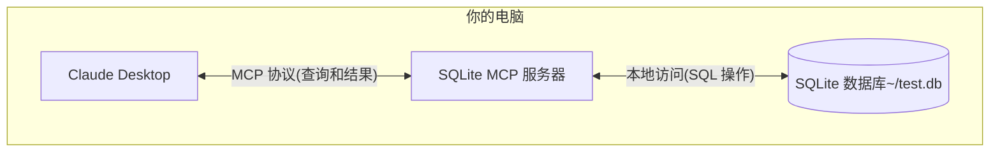

# 快速入门

在了解了 MCP 的一些基础知识后，接下来我们将通过一个简单的示例来演示如何使用 MCP 协议。这里我们以官方提供的 [MCP 示例](https://modelcontextprotocol.io/quickstart) 为例进行说明。

这里我们将通过 MCP 协议将 Claude Desktop 连接到本地 SQLite 数据库，并进行查询和安全分析，整个流程如下图所示：



这里的 SQLite MCP 服务器和本地 SQLite 数据库之间的通信完全在您的计算机上 — 您的 SQLite 数据库不会暴露在互联网上。MCP 协议确保 Claude Desktop 只能通过明确定义的接口执行批准的数据库操作。这为您提供了一种安全的方式让 Claude 分析你的本地数据并与之交互，同时保持对其可以访问的内容的完全控制。

> Claude Desktop 的 MCP 支持目前正在开发人员预览中，仅支持连接到机器上运行的本地 MCP 服务器。尚未支持远程 MCP 连接。此集成仅在 Claude Desktop 应用中可用，而不是 Claude Web 界面（Claude.ai）。

## 准备工作

在开始之前，请确保你的系统已经安装了以下必备组件:

- macOS 或 Windows 操作系统
- 最新版本的 Claude Desktop
- uv 0.4.18 或更高版本 (使用 `uv --version` 检查)
- Git (`git --version` 检查)
- SQLite (`sqlite3 --version` 检查)

对于 macOS 用户，可以使用 [Homebrew](https://brew.sh/) 安装这些组件：

```bash
# Using Homebrew
brew install uv git sqlite3

# 或者直接下载：
# uv: https://docs.astral.sh/uv/
# Git: https://git-scm.com
# SQLite: https://www.sqlite.org/download.html
```

而对于 Windows 用户，可以使用 [winget](https://docs.microsoft.com/en-us/windows/package-manager/winget/) 安装这些组件：

```bash
# 使用 winget 安装
winget install --id=astral-sh.uv -e
winget install git.git sqlite.sqlite

# Or download directly:
# uv: https://docs.astral.sh/uv/
# Git: https://git-scm.com
# SQLite: https://www.sqlite.org/download.html
```

## 安装

接下来我们会以 macOS 为例进行说明，Windows 用户可以参考 macOS 的安装步骤。

首先我们来创建一个简单的 SQLite 数据库，并插入一些数据：

```bash
# 创建一个新的 SQLite 数据库
sqlite3 ~/test.db <<EOF
CREATE TABLE products (
  id INTEGER PRIMARY KEY,
  name TEXT,
  price REAL
);

INSERT INTO products (name, price) VALUES
  ('Widget', 19.99),
  ('Gadget', 29.99),
  ('Gizmo', 39.99),
  ('Smart Watch', 199.99),
  ('Wireless Earbuds', 89.99),
  ('Portable Charger', 24.99),
  ('Bluetooth Speaker', 79.99),
  ('Phone Stand', 15.99),
  ('Laptop Sleeve', 34.99),
  ('Mini Drone', 299.99),
  ('LED Desk Lamp', 45.99),
  ('Keyboard', 129.99),
  ('Mouse Pad', 12.99),
  ('USB Hub', 49.99),
  ('Webcam', 69.99),
  ('Screen Protector', 9.99),
  ('Travel Adapter', 27.99),
  ('Gaming Headset', 159.99),
  ('Fitness Tracker', 119.99),
  ('Portable SSD', 179.99);
EOF
```

然后下载最新的 [Claude Desktop 应用](https://claude.ai/download)，直接安装即可，打开后登录你的 Claude 账号即可正常使用。

然后使用任意编辑器来打开 Claude Desktop 的配置文件 `~/Library/Application Support/Claude/claude_desktop_config.json`。

比如我们这里使用 VSCode 来打开配置文件：

```bash
# 打开配置文件
code ~/Library/Application\ Support/Claude/claude_desktop_config.json
```

然后添加以下配置：

```json
{
  "mcpServers": {
    "sqlite": {
      "command": "uvx",
      "args": ["mcp-server-sqlite", "--db-path", "/Users/YOUR_USERNAME/test.db"]
    }
  }
}
```

需要将 `YOUR_USERNAME` 替换为你的实际用户名。上面的配置文件表示我们定义了名为 `sqlite` 的 MCP 服务器，并指定使用 `uvx` 命令来启动该服务器，在 `args` 参数里面指定了 MCP 服务器以及实际的数据库路径为 `/Users/YOUR_USERNAME/test.db`。

保存上面的配置后，我们需要重启 Claude Desktop 应用，然后就可以在应用内看到 `sqlite` 的 MCP 服务器了。

## 测试

当重新启动 Claude Desktop 后，我们可以在首页输入框右下角发现会多一个如下图所示的按钮：


这里其实表示 Claude Desktop 已经成功加载了 SQLite MCP 服务器，并且可以正常使用。我们点击这个按钮后，就可以看到可用的 MCP Tools 工具列表，如下图所示：


从上图可用看到我们可以进行很多操作，比如查询数据库中的数据，创建新的数据，更新数据，删除数据等。

比如我们发送如下所示的提示词到 Claude Desktop 中：

```
你能连接到我的 SQLite 数据库并告诉我有哪些产品及其价格吗？
```

然后 Claude Desktop 就会根据我们的提示词去查询我们的 SQLite 数据库，第一次会弹出一个授权的对话框，如下图所示：


可以看到这里会选择使用 `list-tables` 的 MCP 工具，这里需要我们点击 `Allow for This Chat` 按钮来授权，然后后续可能会使用到其他工具，同样需要授权。


授权完成后，我们就可以看到查询结果了，如下图所示：


正常情况下，Claude Desktop 会根据我们的提示词去查询数据库，并返回结果。如果这个过程遇到了一些问题，我们可以查看下 Claude Desktop 的日志来排查问题。

```bash
tail -n 20 -f ~/Library/Logs/Claude/mcp*.log


==> /Users/cnych/Library/Logs/Claude/mcp-server-sqlite.log <==
Installed 18 packages in 19ms

==> /Users/cnych/Library/Logs/Claude/mcp.log <==
2024-12-02T08:00:38.208Z [info] Attempting to connect to MCP server sqlite...
2024-12-02T08:00:38.217Z [info] Connected to MCP server sqlite!
```

## 解析

可能大家还是会有很多疑问，为什么我们只是在 Claude Desktop 中添加了一个 sqlite 的 MCP 服务器，就可以查询到数据库中的数据了？这幕后到底发生了什么？

MCP 与 Claude Desktop 交互的流程如下所示：

1. **服务器发现**：Claude Desktop 在启动时连接到您配置的 MCP 服务器
2. **协议握手**：当你询问数据时，Claude Desktop：

   1. 确定哪个 MCP 服务器可以提供帮助（在本例中为 sqlite）
   2. 通过协议协商能力
   3. 从 MCP 服务器请求数据或操作

3. **交互流程**：

   ```mermaid
   sequenceDiagram
      participant C as Claude Desktop
      participant M as MCP 服务器
      participant D as SQLite 数据库

      C->>M: 初始化连接
      M-->>C: 返回可用功能

      C->>M: 查询请求
      M->>D: SQL 查询
      D-->>M: 返回结果
      M-->>C: 格式化结果
   ```

4. **安全**:

   - MCP 服务器仅暴露特定的、受控的功能
   - MCP 服务器在你的本地计算机上运行，它们访问的资源不会暴露在互联网上
   - Claude Desktop 需要用户确认敏感操作

这里可能大家还有点疑问就是 MCP 服务器，我们并没有编写任何代码啊？其实是因为 Claude Desktop 已经 内置实现了一系列的 MCP 服务器，其中就包括 SQLite 的 MCP 服务器，我们只需要配置好数据库路径即可。我们可以在官方的 git 仓库中查看 [内置的 MCP 服务器列表](https://github.com/modelcontextprotocol/servers/tree/main/src)。


可以看到其中就包含一个 SQLite 的 MCP 服务器。通过 SQLite 提供数据库交互和智能业务能力，该服务器支持运行 SQL 查询、分析业务数据等，所以我们直接配置即可使用了。如果我们有自己的业务需求，也可以参考这些内置的实现自定义一个 MCP 服务器即可。

## 访问文件系统

同样的方式我们可以来添加一个访问文件系统的 MCP 服务器，这样我们就可以让 Claude Desktop 管理我们本地的文件系统了，我们可以直接使用 `filesystem` 这个 MCP 服务器。

`filesystem` 这个 MCP 服务器为文件系统操作实现了模型上下文协议 (MCP)：

- 读/写文件
- 创建/列出/删除目录
- 移动文件/目录
- 搜索文件
- 获取文件元数据

这个服务器支持的 Tools 列表如下：

- `read_file`：

  - 阅读文件的完整内容
  - 输入：`path`
  - 使用 UTF-8 编码读取完整的文件内容

- `read_multiple_files`：

  - 同时阅读多个文件
  - 输入：`paths`
  - 读取失败不会停止整个操作

- `write_file`：

  - 创建新文件或覆盖现有
  - 输入：
    - `path`：文件位置
    - `content`：文件内容

- `create_directory`：

  - 创建新目录或确保其存在
  - 输入：`path`
  - 如果需要，创建父目录
  - 如果存在目录，就会默默成功

- `list_directory`：

  - 列表目录目录中的目录或[file]或[dir]前缀
  - 输入：`path`

- `move_file`：

  - 移动或重命名文件和目录
  - 输入：
    - `source`
    - `destination`
  - 如果存在，则会失败

- `search_files`：

  - 递归搜索文件/目录
  - 输入：
    - `path`：起始目录
    - `pattern`：搜索模式
  - 返回比赛的完整路径

- `get_file_info`：

  - 获取详细的文件/目录元数据
  - 输入：`path`
  - 返回：
    - 文件大小
    - 创建时间
    - 修改时间
    - 访问时间
    - 类型（文件/目录）
    - 权限

- `list_allowed_directories`：
  - 列出允许服务器访问的所有目录
  - 无需输入
  - 返回：
    - 该服务器可以读取/写入的目录

同样如果你要在 Claude Desktop 中使用这个 MCP 服务器，只需要配置好文件路径即可，比如我们这里使用桌面路径：

```bash
code ~/Library/Application\ Support/Claude/claude_desktop_config.json
```

然后添加以下配置：

```json
{
  "mcpServers": {
    "filesystem": {
      "command": "npx",
      "args": [
        "-y",
        "@modelcontextprotocol/server-filesystem",
        "/Users/username/Desktop",
        "/path/to/other/allowed/dir"
      ]
    }
  }
}
```

将上面的路径参数替换为你的实际路径即可，比如我们这里现在的完整配置为：

```json
{
  "mcpServers": {
    "sqlite": {
      "command": "uvx",
      "args": ["mcp-server-sqlite", "--db-path", "/Users/cnych/test.db"]
    },
    "filesystem": {
      "command": "npx",
      "args": [
        "-y",
        "@modelcontextprotocol/server-filesystem",
        "/Users/cnych/src"
      ]
    }
  }
}
```

这里我们指定的是 `/Users/cnych/src` 目录，然后保存配置文件并重启 Claude Desktop 应用即可，我们在输入框右下角可以看到现在变成了一个 `15` 的按钮：


点击后可以看到可用的 MCP Tools 列表，如下图所示：


可以看到我们这里可以读取文件，创建文件，列出目录，移动文件，搜索文件等。

我们发送提示词 `Can you list the contents of my src directory?` 后，Claude Desktop 就会列出我们指定目录下的所有文件和目录，如下图所示，当然过程也需要我们授权。


让其帮我们写一个 markdown 的使用指南，并保存到 `markdown-usage.md` 文件中 `Write a complete guide to markdown and save it to markdown-usage.md file`。


经过授权后，我们就可以看到 Claude Desktop 就会自动将文件写入到我们本地指定路径了，如下图所示：


