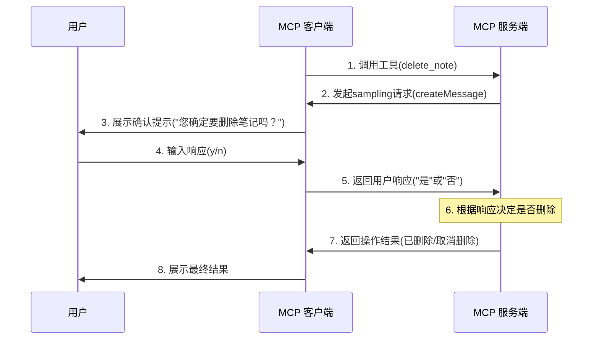

# MCP 中的 Sampling 功能

前面我们有提到 MCP 除了 `Resources`、`Prompts`、`Tools` 之外，还为我们提供了一个 `Sampling` 的功能，从字面上看可能有点难以理解，实际上这个功能就是允许服务器在执行某些操作时请求用户确认或进行交互式决策。比如当我们调用本地文件的删除的工具的时候，肯定是期望我们确认后再进行删除，这个时候就可以使用这个功能。

这是 MCP 协议中的一个特殊能力，让开发者能够在关键操作前请求用户输入。采样（Sampling）在 MCP 中指的是服务器向客户端发起一个请求，要求用户（通常是通过大语言模型）提供特定输入。这个输入可以是对某个问题的回答，或者是对某个操作的确认。

这与传统的服务器-客户端模型不同，在 MCP 中，服务器可以主动向客户端发送请求，要求客户端提供某种形式的"样本"或"输入"，这就是"采样"的含义。

## 工作原理

`Sampling` 功能整体流程如下所示：

1. Server 向 client 发送 `sampling/createMessage` 请求
2. Client 审查请求并可以修改它
3. Client 从 LLM 中 `sampling`
4. Client 审查补全结果
5. Client 将结果返回给 server

这种人机交互设计确保用户可以控制 LLM 看到和生成的内容。

## 消息格式

同样 `Sampling` 功能请求使用标准化的消息格式：

```json
{
  messages: [
    {
      role: "user" | "assistant",
      content: {
        type: "text" | "image",
        // 对于文本：
        text?: string,
        // 对于图像：
        data?: string,             // base64 编码
        mimeType?: string
      }
    }
  ],
  modelPreferences?: {  // 模型偏好
    hints?: [{
      name?: string                // 模型名称
    }],
    costPriority?: number,         // 成本优先级
    speedPriority?: number,        // 速度优先级
    intelligencePriority?: number  // 智能优先级
  },
  systemPrompt?: string,          // 系统提示
  includeContext?: "none" | "thisServer" | "allServers", // 上下文包含
  temperature?: number,           // 温度
  maxTokens: number,             // 最大 tokens 数
  stopSequences?: string[],      // 停止序列
  metadata?: Record<string, unknown> // 元数据
}
```

其中 `messages` 数组包含要发送给 LLM 的对话历史。每条消息都有：

- `role`：`user` 或 `assistant`
- `content`：消息内容，可以是：
  - 带有 `text` 字段的文本内容
  - 带有 `data (base64)` 和 `mimeType` 字段的图像内容

然后是模型偏好设置，`modelPreferences` 对象允许 servers 指定他们的模型选择偏好：

- `hints`：模型名称建议的数组，clients 可以使用它来选择合适的模型：
  - `name`：可以匹配完整或部分模型名称的字符串（例如 “claude-3”, “sonnet”）
  - 客户端可能会将提示词映射到来自不同提供商的等效模型
  - 多个提示按优先顺序评估
- 优先级：
  - `costPriority`：成本最小化的重要性
  - `speedPriority`：低延迟响应的重要性
  - `intelligencePriority`：高级模型功能的重要性

客户端根据这些偏好及其可用模型进行最终的模型选择。

然后是系统提示，`systemPrompt` 字段允许 mcp server 请求特定的 system prompt。客户端可以修改或忽略它。

`includeContext` 参数用于指定需要包含的 MCP 上下文内容：

- `none`：不包含任何额外的上下文
- `thisServer`：包含来自请求 server 的上下文
- `allServers`：包含来自所有已连接 MCP server 的上下文

客户端控制实际包含的上下文。

然后是 sampling 参数，使用以下参数微调 LLM sampling：

- `temperature`：控制随机性（0.0 到 1.0）
- `maxTokens`：要生成的最大 tokens 数
- `stopSequences`：停止生成的序列数组
- `metadata`：其他特定于提供商的参数

最后是响应格式，客户端返回一个补全结果：

```json
{
  model: string, // 使用的模型的名称
  stopReason?: "endTurn" | "stopSequence" | "maxTokens" | string,
  role: "user" | "assistant",
  content: {
    type: "text" | "image",
    text?: string,
    data?: string,
    mimeType?: string
  }
}
```

其中 `model` 是用于生成补全结果的模型名称，`stopReason` 是停止生成的原因，`role` 是补全结果的角色，`content` 是补全结果的内容。

## 最佳实践

在实现 sampling 功能时，我们可以遵循以下最佳实践：

- 始终提供清晰、结构良好的 prompts
- 妥善处理文本和图像内容
- 设置合理的 token 限制
- 通过 `includeContext` 包含相关上下文
- 使用前验证响应内容
- 优雅地处理错误
- 考虑限制 sampling 请求的速率
- 记录预期的 sampling 行为
- 使用各种模型参数进行测试
- 监控 sampling 成本

## 人工干预控制

Sampling 的设计考虑到了人工监督：

**对于提示词**

- Clients 应该向用户显示建议的提示词
- 用户应该能够修改或拒绝提示词
- System prompts 可以被过滤或修改
- 上下文包含由客户端控制

**对于补全结果**

- Clients 应该向用户显示补全结果
- 用户应该能够修改或拒绝补全结果
- Clients 可以过滤或修改补全结果
- 用户控制使用哪个模型

**安全考虑**

在实现 sampling 时：

- 验证所有消息内容
- 清理敏感信息
- 实现适当的速率限制
- 监控 sampling 使用情况
- 加密传输中的数据
- 处理用户数据隐私
- 审计 sampling 请求
- 控制成本暴露
- 实现超时
- 优雅地处理模型错误

## 常见模式

**Agentic 自主工作流**

Sampling 实现了 agentic 自主行为模式，例如：

- 读取和分析资源
- 根据上下文做出决策
- 生成结构化数据
- 处理多步任务
- 提供交互式帮助

**上下文管理**

上下文的最佳实践：

- 请求最少必要的上下文
- 清楚地构建上下文
- 处理上下文大小限制
- 根据需要更新上下文
- 清理过时的上下文

**错误处理**

强大的错误处理应：

- 捕获 sampling 失败
- 处理超时错误
- 管理速率限制
- 验证响应
- 提供回退行为
- 正确记录错误

**限制**

请注意以下限制：

- Sampling 依赖于 client 的功能
- 用户控制 sampling 行为
- 上下文大小有限制
- 可能会应用速率限制
- 应该考虑成本
- 模型可用性各不相同
- 响应时间各不相同
- 并非所有内容类型都受支持

## 实战

接下来我们就来实现一个有删除文件功能的 MCP 服务器，并使用 `Sampling` 功能来实现删除文件的 agentic 自主行为。



首先，初始化 MCP 服务器：

```bash
$ npx @modelcontextprotocol/create-server mcpdemo
? What is the name of your MCP server? mcpdemo
? What is the description of your server? A Model Context Protocol server
? Would you like to install this server for Claude.app? No
✔ MCP server created successfully!

Next steps:
  cd mcpdemo
  npm install
  npm run build  # or: npm run watch
  npm link       # optional, to make available globally

$ cd mcpdemo
$ npm i

> mcpdemo@0.1.0 prepare
> npm run build


> mcpdemo@0.1.0 build
> tsc && node -e "require('fs').chmodSync('build/index.js', '755')"


added 17 packages, and audited 18 packages in 6s

1 package is looking for funding
  run `npm fund` for details

found 0 vulnerabilities
```

接下来直接修改 `src/index.ts` 文件。首先在 Server 的配置中启用 `sampling` 功能：

```ts
const server = new Server(
  {
    name: "mcpdemo",
    version: "0.1.0",
  },
  {
    capabilities: {
      resources: {},
      tools: {},
      prompts: {},
      sampling: {}, // 启用sampling功能
    },
  }
);
```

然后接下来我们添加一个删除笔记的工具：

```ts
/**
 * Handler that lists available tools.
 * Exposes tools for creating and deleting notes.
 */
server.setRequestHandler(ListToolsRequestSchema, async () => {
  return {
    tools: [
      // {  // 原有的创建笔记工具
      //   name: "create_note",
      //   // ...
      // },
      {
        name: "delete_note",
        description: "Delete an existing note with confirmation",
        inputSchema: {
          type: "object",
          properties: {
            id: {
              type: "string",
              description: "ID of the note to delete",
            },
          },
          required: ["id"],
        },
      },
    ],
  };
});
```

然后重点就是在实现 `delete_note` 工具的请求处理：

```ts
/**
 * Handler for tool calls.
 * Handles both create_note and delete_note tools.
 */
server.setRequestHandler(CallToolRequestSchema, async (request) => {
  switch (request.params.name) {
    case "create_note": {
      // ...原有创建笔记的逻辑
    }

    case "delete_note": {
      const id = String(request.params.arguments?.id);
      if (!id) {
        throw new Error("Note ID is required");
      }

      const note = notes[id];
      if (!note) {
        throw new Error(`Note ${id} not found`);
      }

      try {
        // 向客户端发送一个采样请求，让用户确认是否要删除笔记
        const confirmationResponse = await server.createMessage({
          messages: [
            {
              role: "user",
              content: {
                type: "text",
                text: `您确定要删除笔记「${note.title}」吗？请回复"是"或"否"。`,
              },
            },
          ],
          systemPrompt:
            "您是一个帮助用户确认是否删除文件的助手。请只回复'是'或'否'。",
          maxTokens: 10,
          temperature: 0.1,
          includeContext: "none",
        });

        // 获取用户的响应文本
        let userResponse = "";
        if (
          confirmationResponse?.content?.type === "text" &&
          typeof confirmationResponse?.content?.text === "string"
        ) {
          userResponse = confirmationResponse.content.text.toLowerCase();
        }

        // 检查用户是否确认删除
        if (userResponse.includes("是") || userResponse.includes("yes")) {
          // 删除笔记
          delete notes[id];
          return {
            content: [
              {
                type: "text",
                text: `已删除笔记${id}: ${note.title}`,
              },
            ],
          };
        } else {
          // 用户未确认，取消删除
          return {
            content: [
              {
                type: "text",
                text: `取消删除笔记${id}: ${note.title}`,
              },
            ],
          };
        }
      } catch (error) {
        // 处理sampling或删除过程中的错误
        const errorMessage =
          error instanceof Error ? error.message : String(error);
        return {
          content: [
            {
              type: "text",
              text: `删除操作失败: ${errorMessage}`,
            },
          ],
        };
      }
    }

    default:
      throw new Error("Unknown tool");
  }
});
```

在处理删除笔记的时候，我们向客户端发送了一个采样请求，让用户确认是否要删除笔记，这里我们使用的是 `server.createMessage` 方法，这个方法就是用来发送采样请求的，然后请求参数参考前面介绍的 `Sampling` 功能消息格式，如下所示：

```ts
const confirmationResponse = await server.createMessage({
  messages: [
    {
      role: "user",
      content: {
        type: "text",
        text: `您确定要删除笔记「${note.title}」吗？请回复"是"或"否"。`,
      },
    },
  ],
  systemPrompt: "您是一个帮助用户确认是否删除文件的助手。请只回复'是'或'否'。",
  maxTokens: 10,
  temperature: 0.1,
  includeContext: "none",
});
```

这样在 MCP 客户端我们就需要接受这个采样请求，并给出响应，然后 MCP 服务器会根据用户的响应来决定是否删除笔记。我们这里的逻辑是如果用户回复中包含了 "是" 或者 "yes"，则删除笔记，否则不删除。

所以需要客户端支持采样请求，并给出响应，接下来我们需要在客户端中来接受这个采样请求，并给出响应。

```ts
// 初始化客户端的时候需要启用采样功能
const client = new Client(
  { name: "mcpdemo-client", version: "0.1.0" },
  {
    capabilities: {
      sampling: {}, // 启用采样功能
    },
  }
);

// 处理采样请求
function setupSampling(client: Client) {
  const confirmHandler = new SamplingConfirmHandler();

  client.setRequestHandler(CreateMessageRequestSchema, async (request) => {
    // 提取用户消息
    const userMessages = request.params.messages.filter(
      (m) => m.role === "user"
    );
    const lastUserMessage = userMessages[userMessages.length - 1];

    // 获取文本内容
    let userRequest = "未提供明确操作";
    if (lastUserMessage?.content.type === "text") {
      userRequest = lastUserMessage.content.text;
    }

    // 分析请求内容
    const analysis = await confirmHandler.analyzeRequest({
      model: "model",
      role: "assistant",
      content: {
        type: "text",
        text: userRequest,
      },
      systemPrompt: request.params.systemPrompt,
    });

    // 获取用户确认
    const isConfirmed = await confirmHandler.getConfirmation(
      `您是否同意执行此操作? (y/n): `,
      20000
    );

    // 返回响应
    const response = isConfirmed ? "是" : "否";

    return {
      model: "stub-model",
      stopReason: "endTurn",
      role: "assistant",
      content: {
        type: "text",
        text: response,
      },
    };
  });
}
```

上面客户端代码中通过 `client.setRequestHandler(CreateMessageRequestSchema, async (request) => {}` 方法来接受采样请求，我们可以将服务器端发送过来的参数组装成一个 LLM 的请求，因为在服务端我们传递了 `systemPrompt`、`maxTokens`、`temperature`、`messages` 等参数，客户端这里的处理逻辑要看具体的场景，比如我们也可以不进行 LLM 的分析，直接给一个提示，询问用户是否同意执行此操作。

下面是我们的测试过程：

```bash
npm run client

> mcpdemo@0.1.0 client
> node dist/client.js


[成功] 已连接到服务器
[信息] 输入命令或exit退出:

> 列出所有笔记资源
✓ 分析完成 (用时: 6.03s)
[AI] 决定: 我将列出所有可用资源

--- 列出所有资源 ---
[信息] 找到 2 个资源
[信息] 以下是所有可用资源:
1. First Note (note:///1)
   A text note: First Note
2. Second Note (note:///2)
   A text note: Second Note


> 删除笔记 1
✓ 分析完成 (用时: 8.23s)
[AI] 决定: 我将调用工具删除指定的笔记
[AI] 我将调用工具 "delete_note" 来完成您的请求

--- 调用工具: delete_note ---
[信息] 工具描述: Delete an existing note with confirmation
[信息] 输入参数:
[信息]   id: "1"

--- 收到服务器采样请求 ---
✓ 分析结果: 否 (用时: 4.29s)
[信息] 请在20秒内回答，否则默认为"否"
您是否同意执行此操作? (y/n):
[分析结果: 否]y
[信息] 用户决定: 是
[信息] 工具返回内容:
[信息] 已删除笔记1: First Note

>
```

从上面的测试过程我们可以看到，当输入 `删除笔记 1` 的时候，经过 LLM 的分析，告诉我们需要调用 `delete_note` 工具来删除笔记，然后 MCP 服务器会向客户端调用这个工具的请求，这个时候在服务器端的 `delete_note` 工具的请求处理中，会向客户端发送一个采样请求，询问用户是否同意删除笔记，如果用户同意，则删除笔记，否则不删除。

## 总结

通过上面的实战，我们可以看到 `Sampling` 功能在 MCP 中是非常重要的一个功能，它允许 servers 通过 client 请求 LLM 补全，从而实现复杂的 agentic 行为，同时保持安全性和隐私性。
