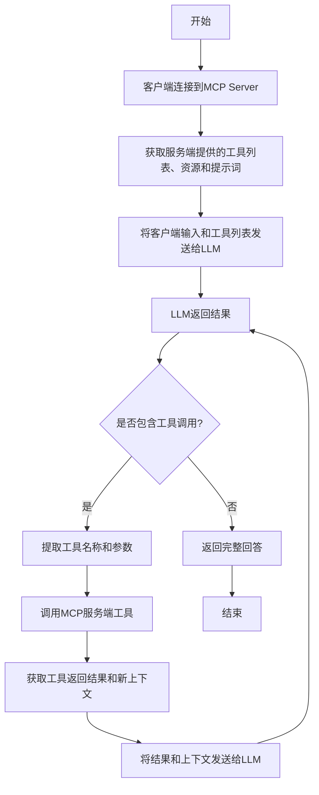

# 编写一个 TypeScript MCP 客户端

[上一节](/docs/write-ts-server)中我们已经成功开发了一个关于天气的 MCP Server，然后我们就可以在支持 MCP 协议的客户端中来使用了，比如 Claude Desktop、Cursor 等。


但是如果我们希望能够自己开发一个客户端，该怎么办呢？

接下来我们就来为大家介绍下如何开发一个 MCP 客户端。

## 流程

要开发一个 MCP 客户端，其实很简单：

1. 首先需要通过客户端去连接到 MCP Server
2. 连接后就可以通过客户端去获取服务端提供的工具列表（也包括资源、提示词）
3. 然后将客户端的输入和工具列表发给支持工具的 LLM（OpenAI、Anthropic 等）
4. 在 LLM 返回结果中获取工具名称和参数
5. 使用上面的工具名称和参数去调用 MCP 服务端工具
6. 调用工具后，将工具的返回结果和新的上下文（包括提示词、资源）发给 LLM
7. 重复上述步骤，直到 LLM 返回完成

可以参考下面的流程：



## 准备工作

接下来我们就使用 TypeScript 来开发一个能够调用前面的天气预报的 MCP 客户端。需要准备的环境如下：

- Node.js 16 及以上版本
- npm 最新版本
- Anthropic API key (Claude)

然后我们创建一个项目目录，并初始化 npm 项目：

```bash
mkdir mcpclient-demo
cd mcpclient-demo
npm init -y
```

安装依赖：

```bash
npm install @anthropic-ai/sdk @modelcontextprotocol/sdk dotenv
npm install -D @types/node typescript
```

创建源文件：

```bash
touch index.ts
```

更新 `package.json` 文件内容，添加 `build` 脚本并设置类型为 `module`：

```json
{
  "name": "mcpclient-demo",
  "version": "1.0.0",
  "main": "index.js",
  "type": "module",
  "scripts": {
    "build": "tsc && chmod 755 build/index.js"
  },
  "keywords": [],
  "author": "",
  "license": "ISC",
  "description": "",
  "dependencies": {
    "@anthropic-ai/sdk": "^0.39.0",
    "@modelcontextprotocol/sdk": "^1.7.0",
    "dotenv": "^16.4.7"
  },
  "devDependencies": {
    "@types/node": "^22.13.12",
    "typescript": "^5.8.2"
  }
}
```

由于我们这里使用的是 TypeScript，所以还需要做根目录下面创建一个 `tsconfig.json` 文件，该文件是用于 TypeScript 的配置文件，内容如下：

```json
{
  "compilerOptions": {
    "target": "ES2022",
    "module": "Node16",
    "moduleResolution": "Node16",
    "outDir": "./build",
    "rootDir": "./",
    "strict": true,
    "esModuleInterop": true,
    "skipLibCheck": true,
    "forceConsistentCasingInFileNames": true
  },
  "include": ["index.ts"],
  "exclude": ["node_modules"]
}
```

然后将准备好的 `ANTHROPIC_API_KEY` 等环境变量写入到 `.env` 文件中：

```text
ANTHROPIC_API_KEY=sk-xxxx
ANTHROPIC_BASE_URL=https://api.anthropic.com
ANTHROPIC_MODEL=claude-3-7-sonnet-20250219
```

## 创建客户端

接下来我们就可以开始创建客户端了。

> 下面的所有操作都在 `index.ts` 文件中进行。

首先我们需要读取环境变量中的 API Key 等配置：

```typescript
import dotenv from "dotenv";

dotenv.config();

const ANTHROPIC_API_KEY = process.env.ANTHROPIC_API_KEY;
const ANTHROPIC_BASE_URL =
  process.env.ANTHROPIC_BASE_URL || "https://api.anthropic.com";
const ANTHROPIC_MODEL =
  process.env.ANTHROPIC_MODEL || "claude-3-7-sonnet-20250219";

if (!ANTHROPIC_API_KEY) {
  throw new Error("ANTHROPIC_API_KEY is not set");
}

if (!ANTHROPIC_BASE_URL) {
  throw new Error("ANTHROPIC_BASE_URL is not set");
}
```

然后创建一个 `MCPClient` 类，并初始化 MCP 客户端和 Anthropic 客户端：

```typescript
import { Client } from "@modelcontextprotocol/sdk/client/index.js";
import { Tool } from "@anthropic-ai/sdk/resources/messages/messages.mjs";
import { StdioClientTransport } from "@modelcontextprotocol/sdk/client/stdio.js";
import { Anthropic } from "@anthropic-ai/sdk";

class MCPClient {
  private mcp: Client;
  private anthropic: Anthropic;
  private transport: StdioClientTransport | null = null;
  private tools: Tool[] = [];

  constructor() {
    this.anthropic = new Anthropic({
      apiKey: ANTHROPIC_API_KEY,
      baseURL: ANTHROPIC_BASE_URL,
    });
    this.mcp = new Client({ name: "mcpclient-demo", version: "1.0.0" });
  }
}
```

这里我们使用 Claude 的 API 来作为 LLM 的实现，其中的 `mcp` 属性是一个 MCP 客户端，直接通过 `new Client` 创建即可，这样我们就拥有了 MCP 客户端的全部能力。

接着就是让我们的 MCP 客户端连接到前面开发好的 MCP Server，由于我们这里的 MCP Server 是一个 Node.js 的脚本，所以我们只需要提供脚本的路径，然后通过 `StdioClientTransport` 来连接即可。连接成功后，我们就可以通过 `listTools` 方法来获取服务端提供的工具列表。

```typescript
async connectToServer(serverScriptPath: string) {
    try {
      const isJs = serverScriptPath.endsWith(".js");
      if (!isJs) {
        throw new Error("Server script must be a .js file");
      }
      const command = process.execPath;

      // 初始化transport
      this.transport = new StdioClientTransport({
        command,
        args: [serverScriptPath],
      });
      // 连接到server
      this.mcp.connect(this.transport);
      // 获取tools列表
      const toolsResult = await this.mcp.listTools();
      this.tools = toolsResult.tools.map((tool) => {
        return {
          name: tool.name,
          description: tool.description,
          input_schema: tool.inputSchema,
        };
      });
      console.log(
        "Connected to server with tools:",
        this.tools.map(({ name }) => name)
      );
    } catch (e) {
      console.log("Failed to connect to MCP server: ", e);
      throw e;
    }
  }
```

工具列表获取到了，接下来就是如何使用这些工具了。

比如我们现在是一个聊天应用，那么正常的流程就是将我的需求发送给 LLM，然后 LLM 返回结果，但是现在我们希望在合适的时候能够调用我们服务端提供的工具，那么这个时候怎么办呢？

也很简单，我们只需要将我们的需求和工具一起发送给 LLM（我们这里是 Anthropic），然后 LLM 返回结果，如果返回的结果是需要调用工具的，那么我们就可以通过 MCP 客户端的 `callTool` 方法来调用工具，当然工具执行的结果我们还需要发送给 LLM 进行处理一次，最后我们就可以得到最终的结果。

下面我们来看下具体的实现：

```typescript
  async processQuery(query: string) {
    // 初始化messages
    const messages: MessageParam[] = [
      {
        role: "user",
        content: query,
      },
    ];

    // 调用anthropic
    const response = await this.anthropic.messages.create({
      model: ANTHROPIC_MODEL,
      max_tokens: 1000,
      messages,
      tools: this.tools,
    });

    // 初始化finalText和toolResults
    const finalText = [];
    const toolResults = [];

    // 遍历response.content
    for (const content of response.content) {
      if (content.type === "text") {  // 如果content的类型是text，则表示是文本
        finalText.push(content.text);
      } else if (content.type === "tool_use") {  // 如果content的类型是tool_use，则表示需要调用工具
        // 获取toolName和toolArgs
        const toolName = content.name;
        const toolArgs = content.input as { [x: string]: unknown } | undefined;

        // 调用tool
        const result = await this.mcp.callTool({
          name: toolName,
          arguments: toolArgs,
        });

        // 添加tool调用信息到finalText
        finalText.push(
          `[Calling tool ${toolName} with args ${JSON.stringify(toolArgs)}]`
        );

        // 添加tool调用结果到messages
        messages.push({
          role: "user",
          content: result.content as string,
        });

        // 调用anthropic
        const response = await this.anthropic.messages.create({
          model: ANTHROPIC_MODEL,
          max_tokens: 1000,
          messages,
        });

        // 合并tool调用结果到finalText
        finalText.push(
          response.content[0].type === "text" ? response.content[0].text : ""
        );
      }
    }

    return finalText.join("\n");
  }

  async chatLoop() {
    const rl = readline.createInterface({
      input: process.stdin,
      output: process.stdout,
    });

    try {
      console.log("\nMCP Client Started!");
      console.log("Type your queries or 'exit' to exit.");

      while (true) {
        // 读取用户输入
        const message = await rl.question("\nQuery: ");
        // 如果用户输入exit，则退出
        if (message.toLowerCase() === "exit") {
          break;
        }

        try {
          // 处理用户输入
          const response = await this.processQuery(message);
          // 输出结果
          console.log("\n" + response);
        } catch (e) {
          console.log("Error: ", e);
        }
      }
    } finally {
      rl.close();
    }
  }

  async cleanup() {
    await this.mcp.close();
  }
```

到这里我们就完成了一个 MCP 客户端的核心功能 - 调用服务端提供的工具。最后只需要在 `main` 函数中进行一些初始化操作，就可以开始我们的聊天了。

```typescript
async function main() {
  if (process.argv.length < 3) {
    console.log("Usage: node index.ts <path_to_server_script>");
    return;
  }
  const mcpClient = new MCPClient();
  try {
    await mcpClient.connectToServer(process.argv[2]);
    await mcpClient.chatLoop();
  } finally {
    await mcpClient.cleanup();
    process.exit(0);
  }
}

main();
```

## 测试

接下来执行下面的命令构建客户端：

```bash
npm run build
```

上面的命令会生成一个 `build/index.js` 文件，然后我们就可以开始测试了。

```bash
node build/index.js
Usage: node index.ts <path_to_server_script>
```

可以看到我们这里只需要传入一个 MCP Server 的脚本路径，然后我们就可以开始测试了。

```bash
node build/index.js /Users/cnych/src/weather-server/build/index.js
# output
Weather MCP server running on stdio
Connected to server with tools: [ 'get_forecast' ]

MCP Client Started!
Type your queries or 'exit' to exit.

Query: Beijing weather for the next 3 days

I can get the weather forecast for Beijing for the next 3 days. Let me do that for you now.
[Calling tool get_forecast with args {"city":"Beijing","days":3}]
# Beijing Weather Forecast

## Next 3 Days:
- **March 24, 2025**: 21°C with overcast clouds
- **March 25, 2025**: 21°C with scattered clouds
- **March 26, 2025**: 20°C with overcast clouds

The temperature will remain relatively stable around 20-21°C over the next three days, with cloudy conditions throughout. March 25th will have partially clear skies with scattered clouds, while the other days will be predominantly overcast.

Query:
```

上面我们提供的 MCP Server 脚本就是前面我们开发好的天气预报服务，这里我们要求查询北京未来 3 天的天气情况，可以看到我们这里就调用了服务端提供的 `get_forecast` 工具，并传入了 `city` 和 `days` 参数，然后我们就可以得到最终的结果。


到这里我们就完成了一个非常简单的 MCP 客户端的开发，并且通过这个客户端我们就可以调用服务端提供的工具，并得到最终的结果。

当然我们这里的这个客户端非常简单，只是一个 Stdio 协议的，如果要链接 SSE 协议的 MCP Server，那么我们就需要添加一个 SSE 协议的客户端，我们将在后续的章节中为大家介绍。
