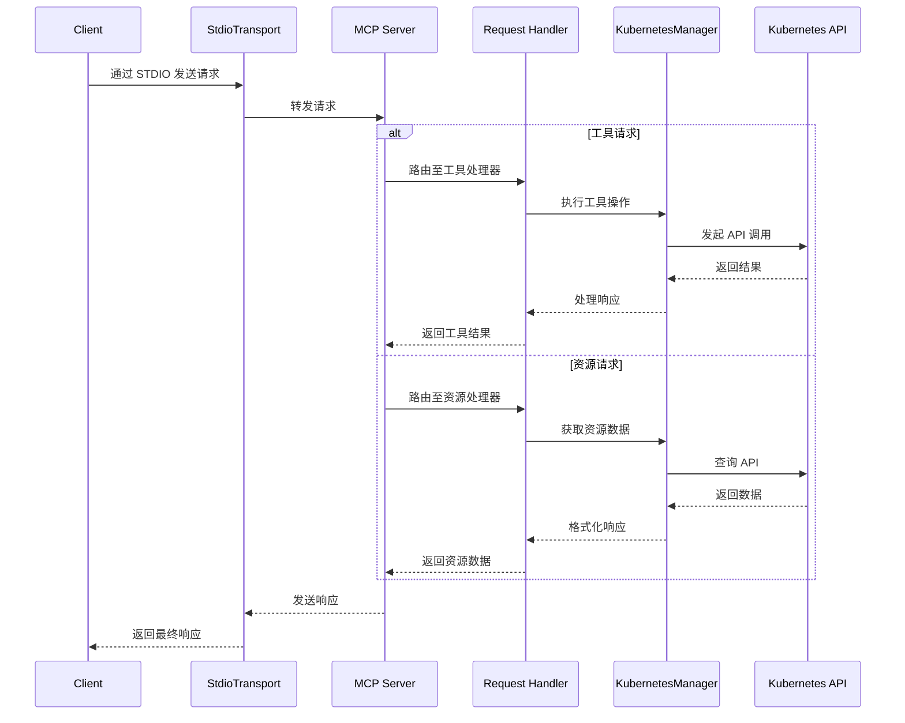

MCP Server 可连接并管理 Kubernetes 集群。

## 与 Claude Desktop 配合使用

```json
{
  "mcpServers": {
    "kubernetes": {
      "command": "npx",
      "args": ["mcp-server-kubernetes"]
    }
  }
}
```

服务器将自动连接至当前 kubectl 上下文环境。请确保已满足以下条件：

1. 已安装 kubectl 并加入 PATH 环境变量
2. 配置了有效的 kubeconfig 文件及上下文
3. 已配置可通过 kubectl 访问的 Kubernetes 集群（如 minikube、Rancher Desktop、GKE 等）
4. 已安装 Helm v3 并加入 PATH（无需 Tiller）。若不使用 Helm 则可选安装。

可通过要求 Claude 列出 Pod 或创建测试部署来验证连接。

若出现错误，请在标准终端中运行 `kubectl get pods` 以检查是否存在集群连接或凭证问题。

## 与 mcp-chat 配合使用

[mcp-chat](https://github.com/Flux159/mcp-chat) 是 MCP 服务器的 CLI 聊天客户端，可用于与 Kubernetes 服务器交互。

```shell
npx mcp-chat --server "npx mcp-server-kubernetes"
```

或传入现有的 Claude Desktop 配置文件（Linux 需传递正确的配置文件路径）：

Mac：

```shell
npx mcp-chat --config "~/Library/Application Support/Claude/claude_desktop_config.json"
```

Windows：

```shell
npx mcp-chat --config "%APPDATA%\Claude\claude_desktop_config.json"
```

## 功能特性

- [x] 连接 Kubernetes 集群
- [x] 列出所有 Pod、服务、部署
- [x] 列出及描述节点
- [x] 创建、描述、删除 Pod
- [x] 列出所有命名空间，创建命名空间
- [x] 创建自定义 Pod 和部署配置，更新部署副本数
- [x] 创建、描述、删除、更新服务
- [x] 创建、获取、更新、删除 ConfigMap
- [x] 获取 Pod 日志用于调试（支持 Pod、部署、任务及标签选择器）
- [x] 支持 Helm v3 安装图表
  - 使用自定义值安装图表
  - 卸载版本
  - 升级现有版本
  - 支持命名空间
  - 支持版本指定
  - 支持自定义仓库
- [x] 支持 kubectl explain 和 kubectl api-resources 命令
- [x] 获取集群 Kubernetes 事件
- [x] 端口转发至 Pod 或服务
- [x] 创建、列出及描述定时任务
- [x] 非破坏性模式，仅提供读取和创建/更新权限

## 本地开发

确保已安装 [bun](https://bun.sh/docs/installation)。克隆仓库并安装依赖：

```bash
git clone https://github.com/Flux159/mcp-server-kubernetes.git
cd mcp-server-kubernetes
bun install
```

### 开发流程

1. 启动开发模式服务器（监听文件变更）：

```bash
bun run dev
```

2. 运行单元测试：

```bash
bun run test
```

3. 构建项目：

```bash
bun run build
```

4. 使用 [Inspector](https://github.com/modelcontextprotocol/inspector) 进行本地测试

```bash
npx @modelcontextprotocol/inspector node dist/index.js
# 按照终端提示操作获取 Inspector 链接
```

5. 通过 Claude Desktop 进行本地测试

```json
{
  "mcpServers": {
    "mcp-server-kubernetes": {
      "command": "node",
      "args": ["/path/to/your/mcp-server-kubernetes/dist/index.js"]
    }
  }
}
```

6. 使用 [mcp-chat](https://github.com/Flux159/mcp-chat) 进行本地测试

```bash
bun run chat
```

## 高级功能

### 其他高级特性

如需了解 SSE 传输、使用 `ALLOW_ONLY_NON_DESTRUCTIVE_TOOLS` 的非破坏性模式等高级信息，请参阅 [ADVANCED_README.md](https://github.com/Flux159/mcp-server-kubernetes/blob/main/ADVANCED_README.md)。

## 架构设计

本节描述 MCP Kubernetes 服务器的高层架构。

### 请求流程

下方序列图展示了请求在系统中的流转过程：



## 发布新版本

前往 [发布页面](https://github.com/Flux159/mcp-server-kubernetes/releases)，点击 "Draft New Release"，选择 "Choose a tag" 并通过输入 "v{major}.{minor}.{patch}" 语义化版本号创建新标签。然后编写发布标题 "Release v{major}.{minor}.{patch}" 及必要的描述/变更日志，点击 "Publish Release"。

这将创建新标签并触发 cd.yml 工作流执行新版本构建。成功后，新版本将发布至 [npm](https://www.npmjs.com/package/mcp-server-kubernetes)。注意无需手动更新 package.json 版本号，工作流将自动更新 package.json 版本并提交至 main 分支。
